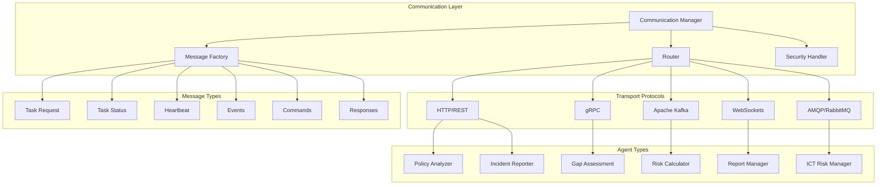

# DORA Compliance Agent Communication Protocols

This module provides standardized communication protocols for inter-agent communication and external system integration within the DORA Compliance Agent Orchestration Platform.

## Architecture Overview

### Core Principles
- **Protocol Standardization**: Common message formats and communication patterns
- **Multi-Transport Support**: HTTP/REST, gRPC, Kafka, WebSockets, and message queues
- **Security-First**: End-to-end encryption, authentication, and authorization
- **Fault Tolerance**: Retry mechanisms, circuit breakers, and graceful degradation
- **Observability**: Comprehensive logging, tracing, and metrics collection
- **Async-First**: Non-blocking communication with async/await patterns

### Communication Architecture



## Message Format Specification

### Standard Message Structure

All messages follow a standardized envelope format:

```json
{
  "header": {
    "message_id": "uuid-v4",
    "correlation_id": "uuid-v4",
    "causation_id": "uuid-v4",
    "timestamp": "2024-01-17T10:30:00.000Z",
    "version": "1.0.0",
    "source": {
      "agent_id": "policy-analyzer-001",
      "agent_type": "policy_analyzer",
      "instance_id": "pa-inst-001"
    },
    "destination": {
      "agent_id": "gap-assessment-001",
      "agent_type": "gap_assessment",
      "broadcast": false
    },
    "message_type": "task_request",
    "content_type": "application/json",
    "encoding": "utf-8",
    "security": {
      "encrypted": true,
      "signature": "base64-encoded-signature",
      "auth_token": "jwt-token"
    },
    "routing": {
      "priority": "high",
      "ttl": 300,
      "retry_count": 0,
      "max_retries": 3
    },
    "tracing": {
      "trace_id": "trace-uuid",
      "span_id": "span-uuid",
      "parent_span_id": "parent-span-uuid"
    }
  },
  "payload": {
    "data": {},
    "metadata": {}
  }
}
```

### Message Types

#### 1. Task Request Message
```json
{
  "header": {
    "message_type": "task_request"
  },
  "payload": {
    "data": {
      "task_id": "task-uuid",
      "task_type": "document_analysis",
      "workflow_id": "workflow-uuid",
      "parameters": {
        "documents": ["doc1.pdf", "doc2.pdf"],
        "analysis_type": "comprehensive",
        "priority": "high"
      },
      "requirements": {
        "cpu": "2",
        "memory": "4Gi",
        "timeout": 900
      },
      "dependencies": ["task-uuid-1", "task-uuid-2"]
    },
    "metadata": {
      "created_by": "workflow-engine",
      "organization": "bank-xyz",
      "compliance_context": "DORA-assessment"
    }
  }
}
```

#### 2. Task Status Update
```json
{
  "header": {
    "message_type": "task_status"
  },
  "payload": {
    "data": {
      "task_id": "task-uuid",
      "status": "running",
      "progress": 0.45,
      "started_at": "2024-01-17T10:30:00.000Z",
      "estimated_completion": "2024-01-17T10:45:00.000Z",
      "partial_results": {
        "documents_processed": 5,
        "current_document": "policy_framework.pdf"
      }
    }
  }
}
```

#### 3. Agent Heartbeat
```json
{
  "header": {
    "message_type": "heartbeat"
  },
  "payload": {
    "data": {
      "agent_status": "healthy",
      "load": 0.75,
      "available_capacity": 0.25,
      "active_tasks": 3,
      "queued_tasks": 1,
      "last_activity": "2024-01-17T10:29:55.000Z",
      "capabilities": ["document_analysis", "policy_extraction"],
      "resource_usage": {
        "cpu_percent": 65.2,
        "memory_percent": 78.1,
        "disk_percent": 45.0
      }
    }
  }
}
```

#### 4. Event Notification
```json
{
  "header": {
    "message_type": "event"
  },
  "payload": {
    "data": {
      "event_type": "compliance_violation_detected",
      "severity": "high",
      "event_data": {
        "violation_type": "missing_backup_procedure",
        "affected_system": "payment_processing",
        "detection_time": "2024-01-17T10:30:00.000Z",
        "compliance_framework": "DORA",
        "article_reference": "Article 11 - Testing"
      },
      "action_required": true,
      "escalation_level": "immediate"
    }
  }
}
```

#### 5. Command Message
```json
{
  "header": {
    "message_type": "command"
  },
  "payload": {
    "data": {
      "command": "cancel_task",
      "target_task_id": "task-uuid",
      "reason": "workflow_cancelled",
      "immediate": true,
      "cleanup_required": true
    }
  }
}
```

#### 6. Response Message
```json
{
  "header": {
    "message_type": "response"
  },
  "payload": {
    "data": {
      "request_id": "request-uuid",
      "status": "success",
      "result": {
        "compliance_score": 0.78,
        "gaps_identified": 12,
        "critical_findings": [
          {
            "finding_id": "DORA-001",
            "severity": "high",
            "description": "Missing incident response automation"
          }
        ]
      },
      "execution_time": 45.2,
      "resource_usage": {
        "cpu_seconds": 120.5,
        "memory_peak_mb": 2048
      }
    }
  }
}
```

## Transport Protocols

### 1. HTTP/REST Protocol

**Base Configuration:**
- HTTPS with TLS 1.3 minimum
- JSON content type with UTF-8 encoding
- Standard HTTP status codes
- RESTful endpoint design

**Endpoint Structure:**
```
POST /api/v1/agents/{agent_id}/tasks
GET  /api/v1/agents/{agent_id}/status
PUT  /api/v1/agents/{agent_id}/tasks/{task_id}
DELETE /api/v1/agents/{agent_id}/tasks/{task_id}
WebSocket /api/v1/agents/{agent_id}/stream
```

**Headers:**
```http
Authorization: Bearer {jwt_token}
Content-Type: application/json; charset=utf-8
X-Correlation-ID: {correlation_id}
X-Trace-ID: {trace_id}
X-Agent-Version: 1.2.0
X-Request-Timeout: 30
```

### 2. gRPC Protocol

**Service Definition:**
```protobuf
syntax = "proto3";

package dora.agent.communication;

service AgentCommunication {
  rpc SendTask(TaskRequest) returns (TaskResponse);
  rpc GetStatus(StatusRequest) returns (StatusResponse);
  rpc StreamEvents(stream EventMessage) returns (stream EventMessage);
  rpc ExecuteCommand(CommandRequest) returns (CommandResponse);
}

message TaskRequest {
  MessageHeader header = 1;
  TaskPayload payload = 2;
}

message TaskResponse {
  MessageHeader header = 1;
  ResponsePayload payload = 2;
}

message MessageHeader {
  string message_id = 1;
  string correlation_id = 2;
  int64 timestamp = 3;
  AgentInfo source = 4;
  AgentInfo destination = 5;
  SecurityInfo security = 6;
}
```

### 3. Apache Kafka Protocol

**Topic Structure:**
```
agent-tasks-{agent_type}
agent-status-updates
agent-events-{event_type}
agent-commands
workflow-coordination
system-monitoring
```

**Message Configuration:**
```yaml
kafka:
  producers:
    acks: all
    retries: 3
    batch_size: 16384
    linger_ms: 5
    compression_type: snappy
    
  consumers:
    group_id: agent-{agent_id}
    auto_offset_reset: earliest
    enable_auto_commit: false
    session_timeout_ms: 30000
```

### 4. WebSocket Protocol

**Connection Management:**
```javascript
// WebSocket endpoint
wss://api.dora-system.com/ws/agents/{agent_id}

// Message frame format
{
  "type": "message",
  "data": {
    // Standard message format
  }
}

// Ping/Pong for keepalive
{
  "type": "ping",
  "timestamp": 1705486200000
}
```

### 5. AMQP/RabbitMQ Protocol

**Exchange and Queue Structure:**
```yaml
exchanges:
  - name: agent.direct
    type: direct
    durable: true
  - name: agent.topic
    type: topic
    durable: true
  - name: agent.fanout
    type: fanout
    durable: true

queues:
  - name: agent.{agent_id}.tasks
    routing_key: task.{agent_type}
  - name: agent.{agent_id}.commands
    routing_key: command.{agent_id}
```

## Security Mechanisms

### 1. Authentication

**JWT Token Structure:**
```json
{
  "header": {
    "alg": "RS256",
    "typ": "JWT",
    "kid": "key-id"
  },
  "payload": {
    "iss": "dora-auth-service",
    "sub": "agent-id",
    "aud": "dora-agents",
    "exp": 1705486200,
    "iat": 1705482600,
    "agent_type": "policy_analyzer",
    "permissions": ["read:tasks", "write:results"],
    "context": {
      "organization": "bank-xyz",
      "environment": "production"
    }
  }
}
```

### 2. Message Encryption

**Encryption Standards:**
- AES-256-GCM for payload encryption
- RSA-4096 or ECDSA P-384 for key exchange
- HMAC-SHA256 for message integrity
- Perfect Forward Secrecy (PFS)

### 3. Message Signing

**Digital Signature Process:**
```python
def sign_message(message: dict, private_key: str) -> str:
    """Sign message with agent's private key"""
    message_bytes = json.dumps(message, sort_keys=True).encode()
    signature = rsa.sign(message_bytes, private_key, 'SHA-256')
    return base64.b64encode(signature).decode()

def verify_signature(message: dict, signature: str, public_key: str) -> bool:
    """Verify message signature"""
    message_bytes = json.dumps(message, sort_keys=True).encode()
    try:
        rsa.verify(message_bytes, base64.b64decode(signature), public_key)
        return True
    except rsa.VerificationError:
        return False
```

## Retry and Error Handling

### 1. Retry Policies

**Exponential Backoff Configuration:**
```yaml
retry_policies:
  default:
    max_attempts: 3
    initial_delay: 1.0
    max_delay: 60.0
    backoff_multiplier: 2.0
    jitter: true
    
  critical_task:
    max_attempts: 5
    initial_delay: 0.5
    max_delay: 30.0
    backoff_multiplier: 1.5
    
  heartbeat:
    max_attempts: 2
    initial_delay: 5.0
    max_delay: 10.0
    backoff_multiplier: 1.0
```

### 2. Circuit Breaker Pattern

**Circuit Breaker States:**
- **Closed**: Normal operation, requests pass through
- **Open**: Failures exceed threshold, requests fail fast
- **Half-Open**: Test requests to check recovery

**Configuration:**
```yaml
circuit_breaker:
  failure_threshold: 5
  success_threshold: 3
  timeout: 60
  monitoring_period: 30
```

### 3. Dead Letter Queue

**Failed Message Handling:**
```yaml
dead_letter_queue:
  max_retries: 3
  retention_period: "7d"
  analysis_enabled: true
  auto_replay: false
  escalation:
    - condition: "retry_count > 3"
      action: "notify_ops"
    - condition: "age > 1h"
      action: "escalate_management"
```

## Message Serialization

### 1. JSON Serialization

**Custom JSON Encoder:**
```python
class DORAMessageEncoder(json.JSONEncoder):
    def default(self, obj):
        if isinstance(obj, datetime):
            return obj.isoformat()
        elif isinstance(obj, UUID):
            return str(obj)
        elif isinstance(obj, Decimal):
            return float(obj)
        elif hasattr(obj, '__dict__'):
            return obj.__dict__
        return super().default(obj)
```

### 2. Protocol Buffers

**Performance-Critical Messages:**
```protobuf
message PerformanceMetrics {
  string agent_id = 1;
  double cpu_usage = 2;
  double memory_usage = 3;
  int64 task_count = 4;
  repeated TaskMetric tasks = 5;
}

message TaskMetric {
  string task_id = 1;
  double execution_time = 2;
  TaskStatus status = 3;
}
```

### 3. Apache Avro

**Schema Evolution Support:**
```json
{
  "type": "record",
  "name": "AgentMessage",
  "namespace": "com.dora.agent",
  "fields": [
    {"name": "id", "type": "string"},
    {"name": "timestamp", "type": "long"},
    {"name": "agent_id", "type": "string"},
    {"name": "message_type", "type": "string"},
    {"name": "payload", "type": "bytes"},
    {"name": "version", "type": "string", "default": "1.0.0"}
  ]
}
```

## External System Integration

### 1. Database Systems

**Connection Patterns:**
```python
# PostgreSQL with connection pooling
postgres_config = {
    "host": "postgres.dora-system.svc.cluster.local",
    "port": 5432,
    "database": "dora_compliance",
    "pool_size": 10,
    "max_overflow": 20,
    "pool_timeout": 30
}

# Redis for caching and sessions
redis_config = {
    "url": "redis://redis-cluster.dora-system.svc.cluster.local:6379",
    "decode_responses": True,
    "health_check_interval": 30
}
```

### 2. External APIs

**REST API Integration:**
```python
class ExternalAPIAdapter:
    def __init__(self, base_url: str, auth_token: str):
        self.base_url = base_url
        self.session = aiohttp.ClientSession(
            timeout=aiohttp.ClientTimeout(total=30),
            headers={"Authorization": f"Bearer {auth_token}"}
        )
    
    async def call_api(self, endpoint: str, data: dict) -> dict:
        async with self.session.post(f"{self.base_url}/{endpoint}", json=data) as response:
            response.raise_for_status()
            return await response.json()
```

### 3. File Systems

**Distributed File Access:**
```python
# S3-compatible storage
storage_config = {
    "provider": "aws_s3",
    "bucket": "dora-compliance-data",
    "access_key_id": "from_vault",
    "secret_access_key": "from_vault",
    "region": "us-west-2"
}

# Network file systems
nfs_config = {
    "mount_point": "/mnt/dora-shared",
    "server": "nfs.dora-system.svc.cluster.local",
    "options": "vers=4,rsize=8192,wsize=8192"
}
```

## Performance Optimization

### 1. Connection Pooling

**HTTP Connection Pools:**
```python
connector = aiohttp.TCPConnector(
    limit=100,
    limit_per_host=30,
    ttl_dns_cache=300,
    use_dns_cache=True,
    keepalive_timeout=30,
    enable_cleanup_closed=True
)
```

### 2. Message Batching

**Batch Processing Configuration:**
```yaml
batching:
  max_batch_size: 100
  max_wait_time: 5000  # milliseconds
  batch_timeout: 30000
  compression: true
  
batch_strategies:
  - type: "size_based"
    trigger: 50
  - type: "time_based" 
    trigger: 2000
  - type: "memory_based"
    trigger: "10MB"
```

### 3. Caching Strategies

**Multi-Level Caching:**
```yaml
caching:
  levels:
    - name: "local"
      type: "memory"
      size: "100MB"
      ttl: 300
      
    - name: "distributed"
      type: "redis"
      size: "1GB"
      ttl: 3600
      
    - name: "persistent"
      type: "database"
      ttl: 86400
```

## Monitoring and Observability

### 1. Metrics Collection

**Prometheus Metrics:**
```python
from prometheus_client import Counter, Histogram, Gauge

# Message metrics
messages_sent = Counter('agent_messages_sent_total', 'Total sent messages', ['agent_type', 'destination'])
message_duration = Histogram('agent_message_duration_seconds', 'Message processing time')
active_connections = Gauge('agent_active_connections', 'Active connections', ['protocol'])
```

### 2. Distributed Tracing

**OpenTelemetry Integration:**
```python
from opentelemetry import trace
from opentelemetry.exporter.jaeger.thrift import JaegerExporter

tracer = trace.get_tracer(__name__)

@tracer.start_as_current_span("send_message")
async def send_message(message: Message, destination: str):
    span = trace.get_current_span()
    span.set_attribute("message.type", message.type)
    span.set_attribute("destination.agent_id", destination)
    
    # Send message implementation
    result = await transport.send(message, destination)
    
    span.set_attribute("message.sent", True)
    return result
```

### 3. Audit Logging

**Structured Audit Logs:**
```json
{
  "timestamp": "2024-01-17T10:30:00.000Z",
  "event_type": "message_sent",
  "actor": {
    "agent_id": "policy-analyzer-001",
    "agent_type": "policy_analyzer"
  },
  "target": {
    "agent_id": "gap-assessment-001",
    "message_type": "task_request"
  },
  "context": {
    "workflow_id": "workflow-uuid",
    "task_id": "task-uuid",
    "organization": "bank-xyz"
  },
  "result": "success",
  "metadata": {
    "message_size": 2048,
    "transport": "https",
    "encrypted": true
  }
}
```

## Configuration Management

### 1. Environment-Specific Configs

**Development Environment:**
```yaml
communication:
  protocols:
    http:
      enabled: true
      port: 8080
      tls: false
    grpc:
      enabled: false
    kafka:
      enabled: true
      brokers: ["localhost:9092"]
      
  security:
    authentication: false
    encryption: false
    
  retry:
    max_attempts: 2
    initial_delay: 0.5
```

**Production Environment:**
```yaml
communication:
  protocols:
    http:
      enabled: true
      port: 443
      tls: true
      cert_file: "/etc/certs/tls.crt"
      key_file: "/etc/certs/tls.key"
    grpc:
      enabled: true
      port: 9090
      tls: true
    kafka:
      enabled: true
      brokers: 
        - "kafka-1.dora-system.svc.cluster.local:9092"
        - "kafka-2.dora-system.svc.cluster.local:9092"
        - "kafka-3.dora-system.svc.cluster.local:9092"
      
  security:
    authentication: true
    encryption: true
    vault_address: "https://vault.dora-system.svc.cluster.local:8200"
    
  retry:
    max_attempts: 5
    initial_delay: 1.0
    max_delay: 60.0
```

## Testing Strategies

### 1. Unit Testing

**Message Protocol Tests:**
```python
def test_message_serialization():
    message = TaskRequest(
        task_id="test-task",
        agent_type="policy_analyzer",
        parameters={"documents": ["test.pdf"]}
    )
    
    serialized = message.to_json()
    deserialized = TaskRequest.from_json(serialized)
    
    assert deserialized.task_id == message.task_id
    assert deserialized.parameters == message.parameters
```

### 2. Integration Testing

**End-to-End Communication:**
```python
@pytest.mark.asyncio
async def test_agent_communication():
    # Start mock agents
    sender = MockAgent("sender-001", "policy_analyzer")
    receiver = MockAgent("receiver-001", "gap_assessment")
    
    # Send task request
    task = TaskRequest(task_id="test", agent_type="gap_assessment")
    response = await sender.send_task(receiver.agent_id, task)
    
    assert response.status == "accepted"
    assert response.task_id == task.task_id
```

### 3. Performance Testing

**Load Testing Configuration:**
```yaml
load_testing:
  scenarios:
    - name: "normal_load"
      agents: 10
      messages_per_second: 100
      duration: "5m"
      
    - name: "peak_load"
      agents: 50
      messages_per_second: 1000
      duration: "10m"
      
    - name: "stress_test"
      agents: 100
      messages_per_second: 5000
      duration: "2m"
```

This communication protocol implementation provides a comprehensive, secure, and scalable foundation for inter-agent communication in the DORA Compliance Agent Orchestration Platform. 