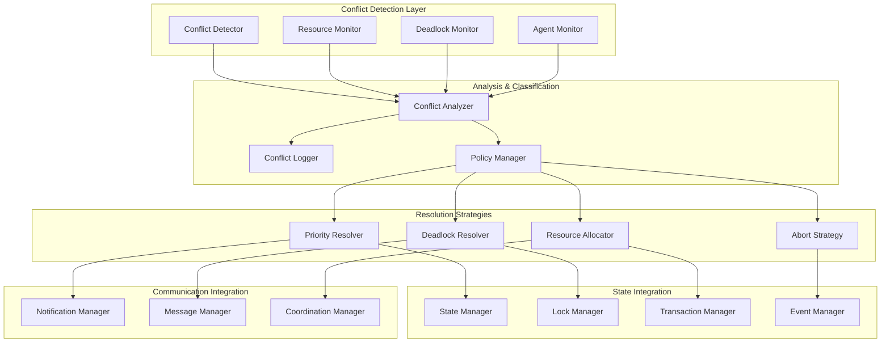

# DORA Compliance Agent Conflict Resolution System

This module provides a comprehensive conflict resolution system for the DORA compliance agent orchestration platform, ensuring efficient resource allocation, preventing deadlocks, and resolving conflicts between competing agents and workflows.

## Architecture Overview

### Core Principles
- **Proactive Detection**: Early identification of potential conflicts before they escalate
- **Fair Resolution**: Priority-based and policy-driven conflict resolution strategies
- **Deadlock Prevention**: Advanced algorithms to prevent and resolve deadlocks
- **Performance Optimization**: Minimal overhead on system performance
- **Audit Trail**: Complete logging and analysis of all conflicts and resolutions
- **Configurable Policies**: Flexible policy engine for different conflict scenarios

### Conflict Resolution Architecture



## Conflict Types and Detection

### 1. Resource Conflicts

**Description**: Multiple agents or workflows competing for the same computational or data resources.

**Detection Criteria**:
- CPU/Memory/Storage allocation conflicts
- Database connection pool exhaustion
- External service rate limit conflicts
- License or quota violations

**Example Scenario**:
```yaml
conflict:
  type: resource_allocation
  resource: cpu_cores
  requests:
    - agent: policy-analyzer-001
      required: 8
      priority: high
    - agent: gap-assessment-002
      required: 6
      priority: medium
  available: 10
  resolution: priority_preemption
```

### 2. Data Access Conflicts

**Description**: Concurrent access to the same data entities with conflicting operations.

**Detection Criteria**:
- Read-write conflicts on the same entity
- Write-write conflicts with overlapping scope
- Transaction isolation violations
- Pessimistic lock timeouts

**Example Scenario**:
```yaml
conflict:
  type: data_access
  entity: workflow:wf-123
  operations:
    - agent: scheduler
      operation: update_status
      lock_type: exclusive
    - agent: monitor
      operation: read_metrics
      lock_type: shared
  resolution: lock_escalation
```

### 3. Workflow Dependencies

**Description**: Circular dependencies or blocked workflows waiting for resources.

**Detection Criteria**:
- Circular dependency detection in workflow graphs
- Deadlock in task execution chains
- Resource starvation scenarios
- Priority inversion situations

**Example Scenario**:
```yaml
conflict:
  type: workflow_dependency
  workflows:
    - id: wf-compliance-A
      waiting_for: risk-analysis-dataset
      held_by: wf-risk-B
    - id: wf-risk-B
      waiting_for: compliance-report
      held_by: wf-compliance-A
  resolution: priority_ordering
```

### 4. Agent Competition

**Description**: Multiple agents attempting to claim the same tasks or resources.

**Detection Criteria**:
- Task assignment conflicts
- Agent capability overlaps
- Load balancing failures
- Service discovery conflicts

**Example Scenario**:
```yaml
conflict:
  type: agent_competition
  task: task-policy-analysis-456
  candidates:
    - agent: policy-analyzer-001
      capability_score: 0.95
      current_load: 0.3
    - agent: policy-analyzer-002
      capability_score: 0.90
      current_load: 0.1
  resolution: load_balancing
```

## Resolution Strategies

### 1. Priority-Based Resolution

**Algorithm**: Higher priority agents/workflows get precedence in conflict situations.

**Implementation**:
- Dynamic priority calculation based on business criticality
- Time-based priority decay to prevent starvation
- User-defined priority overrides
- SLA-based priority adjustments

```python
def calculate_dynamic_priority(base_priority: int, age: timedelta, sla_factor: float) -> float:
    # Priority increases with age to prevent starvation
    age_boost = min(age.total_seconds() / 3600, 2.0)  # Max 2.0 boost over 2 hours
    return base_priority * sla_factor + age_boost
```

### 2. Resource Preemption

**Algorithm**: Lower priority processes are preempted to make way for higher priority ones.

**Implementation**:
- Graceful preemption with checkpoint/resume capability
- Cost-benefit analysis for preemption decisions
- Preemption history tracking to prevent thrashing
- Rollback mechanisms for failed preemptions

### 3. Deadlock Detection and Resolution

**Algorithm**: Graph-based cycle detection with targeted resolution.

**Implementation**:
- Wait-for graph construction and analysis
- Banker's algorithm for deadlock prevention
- Victim selection based on rollback cost
- Distributed deadlock detection across nodes

```python
def detect_deadlock(wait_graph: Dict[str, List[str]]) -> Optional[List[str]]:
    """Detect cycles in wait-for graph using DFS"""
    def dfs(node: str, visited: Set[str], path: List[str]) -> Optional[List[str]]:
        if node in path:
            # Found cycle
            cycle_start = path.index(node)
            return path[cycle_start:]
        
        if node in visited:
            return None
            
        visited.add(node)
        path.append(node)
        
        for neighbor in wait_graph.get(node, []):
            cycle = dfs(neighbor, visited, path)
            if cycle:
                return cycle
                
        path.pop()
        return None
    
    visited = set()
    for node in wait_graph:
        if node not in visited:
            cycle = dfs(node, visited, [])
            if cycle:
                return cycle
    
    return None
```

### 4. Fair Queuing and Throttling

**Algorithm**: Time-sliced resource allocation with fair queuing principles.

**Implementation**:
- Weighted fair queuing for different agent classes
- Token bucket rate limiting
- Adaptive throttling based on system load
- Quality of Service (QoS) guarantees

## Configuration and Policies

### Policy Configuration Format

```yaml
conflict_resolution_policy:
  # Global settings
  detection_interval: 5  # seconds
  resolution_timeout: 30  # seconds
  max_retries: 3
  
  # Resource conflict policies
  resource_conflicts:
    cpu:
      strategy: priority_preemption
      preemption_threshold: 0.8  # 80% utilization
      grace_period: 10  # seconds
    
    memory:
      strategy: fair_share
      min_allocation: 1GB
      max_allocation: 16GB
    
    storage:
      strategy: quota_enforcement
      default_quota: 100GB
      burst_allowance: 1.2  # 20% burst
  
  # Data access conflict policies
  data_conflicts:
    strategy: lock_escalation
    lock_timeout: 30  # seconds
    retry_interval: 1  # seconds
    max_wait_time: 300  # 5 minutes
  
  # Workflow dependency policies
  workflow_conflicts:
    strategy: dependency_ordering
    deadlock_timeout: 60  # seconds
    max_dependency_depth: 10
    circular_dependency_action: abort_lowest_priority
  
  # Agent competition policies
  agent_conflicts:
    strategy: capability_matching
    load_balance_factor: 0.3
    capability_weight: 0.7
    prefer_local_agents: true
  
  # Priority calculation
  priority_settings:
    base_priorities:
      critical: 10
      high: 7
      medium: 5
      low: 3
      background: 1
    
    aging_factor: 0.1  # priority increase per hour
    sla_multipliers:
      platinum: 1.5
      gold: 1.2
      silver: 1.0
      bronze: 0.8
```

### Dynamic Policy Updates

The system supports runtime policy updates without service restart:

```python
# Update specific policy section
await conflict_resolver.update_policy("resource_conflicts.cpu.preemption_threshold", 0.9)

# Load new policy configuration
new_policy = load_policy_from_file("updated_policy.yaml")
await conflict_resolver.apply_policy(new_policy)
```

## Performance Optimization

### Conflict Detection Optimization

1. **Incremental Detection**: Only analyze changed entities
2. **Sampling**: Statistical sampling for large-scale systems
3. **Predictive Analysis**: ML-based conflict prediction
4. **Hierarchical Monitoring**: Different granularities for different conflict types

### Resolution Performance

1. **Fast Path Resolution**: Immediate resolution for simple conflicts
2. **Batch Processing**: Group resolution for multiple conflicts
3. **Caching**: Cache resolution decisions for similar scenarios
4. **Parallel Resolution**: Independent conflict resolution in parallel

### Memory and CPU Optimization

1. **Event-Driven Architecture**: React only to relevant state changes
2. **Efficient Data Structures**: Optimized graphs and hash tables
3. **Lazy Evaluation**: Compute complex metrics only when needed
4. **Resource Pooling**: Reuse resolution workers and data structures

## Monitoring and Analytics

### Conflict Metrics

```python
class ConflictMetrics:
    def __init__(self):
        self.total_conflicts = Counter()
        self.resolution_times = []
        self.resolution_success_rate = {}
        self.deadlock_incidents = []
        self.preemption_events = []
        
    def record_conflict(self, conflict_type: str, resolution_time: float, success: bool):
        self.total_conflicts[conflict_type] += 1
        self.resolution_times.append(resolution_time)
        
        if conflict_type not in self.resolution_success_rate:
            self.resolution_success_rate[conflict_type] = []
        self.resolution_success_rate[conflict_type].append(success)
```

### Dashboard Integration

- Real-time conflict visualization
- Resolution strategy effectiveness analysis
- Resource utilization trends
- Deadlock frequency and patterns
- Agent competition statistics

### Alerting and Notifications

```yaml
alerting_rules:
  - name: high_conflict_rate
    condition: conflicts_per_minute > 10
    severity: warning
    notification: operations_team
  
  - name: deadlock_detected
    condition: deadlock_incidents > 0
    severity: critical
    notification: engineering_team
  
  - name: resolution_failure_rate
    condition: resolution_success_rate < 0.95
    severity: warning
    notification: platform_team
```

## Integration Points

### State Management Integration

The conflict resolution system integrates tightly with the state management system:

```python
# Monitor state changes for conflict detection
state_manager.register_observer(conflict_detector.on_state_change)

# Use distributed locking for conflict resolution
async with state_manager.exclusive_lock(EntityType.RESOURCE, resource_id):
    await resolve_resource_conflict(resource_id, conflict_info)
```

### Communication Integration

Agents are notified about conflicts and resolutions through the communication system:

```python
# Notify agent about resource preemption
await communication_manager.send_message(
    agent_id,
    MessageType.RESOURCE_PREEMPTION,
    {
        "resource_id": resource_id,
        "reason": "higher_priority_request",
        "grace_period": 30
    }
)
```

### Workflow Engine Integration

The workflow engine uses conflict resolution for task scheduling:

```python
# Check for conflicts before task assignment
conflicts = await conflict_detector.check_assignment_conflicts(task_id, agent_id)
if conflicts:
    resolution = await conflict_resolver.resolve_conflicts(conflicts)
    await apply_resolution(resolution)
```

## Testing and Validation

### Unit Testing Scenarios

1. **Basic Conflict Detection**: Simple resource and data conflicts
2. **Deadlock Scenarios**: Various deadlock patterns and resolution
3. **Priority Calculations**: Dynamic priority updates and fairness
4. **Policy Application**: Configuration changes and enforcement

### Integration Testing

1. **Multi-Agent Scenarios**: Complex workflows with multiple agents
2. **High Load Testing**: System behavior under heavy conflict load
3. **Failure Scenarios**: Partial system failures and recovery
4. **Performance Testing**: Resolution latency and throughput

### Chaos Engineering

1. **Resource Starvation**: Simulate extreme resource constraints
2. **Network Partitions**: Test distributed conflict resolution
3. **Agent Failures**: Conflict resolution during agent crashes
4. **Policy Corruption**: Recovery from invalid policy configurations

This conflict resolution system provides a robust foundation for managing complex multi-agent interactions while maintaining system stability, fairness, and performance in the DORA compliance platform. 