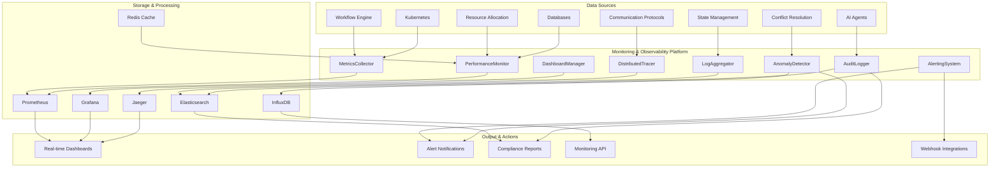

# Monitoring and Observability System

The Monitoring and Observability System provides comprehensive visibility into the DORA Compliance Agent Orchestration Platform, delivering real-time insights into platform health, performance metrics, agent behavior, and compliance audit trails.

## Architecture Overview



## Core Features

### 1. Metrics Collection
- **Real-time Metrics**: Continuous collection of performance and operational metrics
- **Custom Metrics**: Business-specific metrics for DORA compliance workflows
- **Multi-dimensional Data**: Rich labeling and tagging for detailed analysis
- **Aggregation Support**: Time-based and dimension-based metric aggregation
- **Historical Retention**: Long-term storage with configurable retention policies

### 2. Distributed Tracing
- **End-to-End Visibility**: Complete request tracing across all system components
- **Correlation Tracking**: Trace correlation across agent interactions
- **Performance Profiling**: Detailed timing and performance analysis
- **Error Attribution**: Precise error location and root cause analysis
- **Sampling Strategies**: Intelligent sampling for high-volume environments

### 3. Log Aggregation
- **Centralized Logging**: Unified log collection from all platform components
- **Structured Logging**: JSON-based structured log format for easy parsing
- **Log Enrichment**: Automatic addition of context and metadata
- **Search and Analysis**: Full-text search and log analysis capabilities
- **Retention Management**: Automated log rotation and archival

### 4. Alerting System
- **Multi-channel Alerts**: Email, Slack, PagerDuty, webhook notifications
- **Smart Routing**: Context-aware alert routing to appropriate teams
- **Alert Correlation**: Intelligent grouping and correlation of related alerts
- **Escalation Policies**: Configurable escalation chains and on-call schedules
- **Alert Suppression**: Maintenance windows and alert suppression rules

### 5. Performance Analysis
- **Resource Utilization**: CPU, memory, disk, and network usage analysis
- **Throughput Metrics**: Request rates, processing times, and queue depths
- **Bottleneck Identification**: Automated detection of performance bottlenecks
- **Capacity Planning**: Historical analysis for resource planning
- **SLA Monitoring**: Service level agreement compliance tracking

### 6. Anomaly Detection
- **Machine Learning Models**: AI-powered anomaly detection algorithms
- **Baseline Learning**: Automatic learning of normal behavior patterns
- **Real-time Detection**: Immediate notification of anomalous behavior
- **False Positive Reduction**: Intelligent filtering and confidence scoring
- **Custom Thresholds**: Configurable thresholds for different metrics

### 7. Audit Logging
- **Compliance Tracking**: Complete audit trail for DORA compliance requirements
- **Security Events**: Authentication, authorization, and security event logging
- **Data Access Logs**: Detailed logging of all data access and modifications
- **Immutable Records**: Tamper-proof audit log storage
- **Regulatory Reporting**: Automated generation of compliance reports

### 8. Real-time Dashboards
- **Executive Dashboards**: High-level KPIs and business metrics
- **Operational Dashboards**: Real-time system health and performance
- **Agent-specific Views**: Individual agent performance and behavior
- **Compliance Dashboards**: DORA compliance status and metrics
- **Custom Visualizations**: Flexible chart and graph configurations

## Metrics Categories

### System Metrics
```yaml
system_metrics:
  cpu:
    - utilization_percentage
    - load_average
    - core_count
  
  memory:
    - utilization_percentage
    - available_bytes
    - cache_hit_ratio
  
  disk:
    - utilization_percentage
    - iops
    - throughput_mbps
  
  network:
    - bandwidth_utilization
    - packet_loss_rate
    - latency_ms
```

### Application Metrics
```yaml
application_metrics:
  workflow_engine:
    - workflows_active
    - workflows_completed
    - workflow_duration_seconds
    - error_rate
  
  communication:
    - messages_sent_total
    - messages_received_total
    - message_latency_seconds
    - connection_pool_size
  
  resource_allocation:
    - allocations_active
    - allocation_success_rate
    - resource_utilization
    - quota_usage_percentage
```

### Business Metrics
```yaml
business_metrics:
  dora_compliance:
    - deployment_frequency
    - lead_time_for_changes
    - change_failure_rate
    - time_to_restore_service
  
  agent_performance:
    - task_completion_rate
    - agent_availability
    - analysis_accuracy
    - processing_time
  
  security:
    - authentication_attempts
    - authorization_failures
    - security_incidents
    - compliance_violations
```

## Distributed Tracing

### Trace Structure
```yaml
trace:
  trace_id: "550e8400-e29b-41d4-a716-446655440000"
  parent_span_id: "6ba7b810-9dad-11d1-80b4-00c04fd430c8"
  span_id: "6ba7b811-9dad-11d1-80b4-00c04fd430c8"
  operation_name: "agent.execute_workflow"
  start_time: "2024-01-15T10:30:00Z"
  end_time: "2024-01-15T10:30:05Z"
  duration_ms: 5000
  status: "success"
  
  tags:
    service: "policy_analyzer"
    version: "1.0.0"
    environment: "production"
    workflow_id: "compliance_audit_2024"
    agent_type: "policy_analyzer"
  
  logs:
    - timestamp: "2024-01-15T10:30:01Z"
      level: "info"
      message: "Starting policy analysis"
    - timestamp: "2024-01-15T10:30:03Z"
      level: "debug"
      message: "Processing regulation XYZ"
```

### Span Types
- **Entry Spans**: External requests entering the system
- **Exit Spans**: Calls to external services or databases
- **Local Spans**: Internal processing within a service
- **Async Spans**: Asynchronous operations and background tasks

## Alerting Configuration

### Alert Types
```yaml
alert_types:
  critical:
    - system_down
    - data_corruption
    - security_breach
    - compliance_violation
  
  warning:
    - high_resource_usage
    - performance_degradation
    - quota_exceeded
    - error_rate_increase
  
  info:
    - deployment_complete
    - maintenance_window
    - configuration_change
    - scheduled_task_complete
```

### Alert Rules
```yaml
alert_rules:
  high_cpu_usage:
    metric: "cpu_utilization_percentage"
    threshold: 85
    duration: "5m"
    severity: "warning"
    channels: ["email", "slack"]
  
  workflow_failure_rate:
    metric: "workflow_error_rate"
    threshold: 0.05  # 5%
    duration: "10m"
    severity: "critical"
    channels: ["pagerduty", "slack"]
  
  dora_metric_degradation:
    metric: "deployment_frequency"
    threshold: 0.5  # 50% decrease
    duration: "1h"
    severity: "warning"
    channels: ["email"]
```

### Notification Channels
```yaml
notification_channels:
  email:
    smtp_server: "smtp.company.com"
    recipients: ["ops@company.com", "dev@company.com"]
    templates: ["alert_template.html"]
  
  slack:
    webhook_url: "https://hooks.slack.com/services/..."
    channels: ["#ops-alerts", "#dora-compliance"]
    mention_users: ["@ops-team"]
  
  pagerduty:
    integration_key: "32-character-integration-key"
    severity_mapping:
      critical: "critical"
      warning: "warning"
      info: "info"
```

## Dashboard Configurations

### Executive Dashboard
```yaml
executive_dashboard:
  title: "DORA Compliance Executive View"
  refresh_interval: "5m"
  
  panels:
    - title: "Deployment Frequency"
      type: "stat"
      metric: "deployments_per_day"
      target: 10
    
    - title: "Lead Time for Changes"
      type: "gauge"
      metric: "lead_time_hours"
      thresholds: [24, 168, 720]  # 1 day, 1 week, 1 month
    
    - title: "Change Failure Rate"
      type: "stat"
      metric: "change_failure_rate"
      unit: "percent"
    
    - title: "Time to Restore Service"
      type: "gauge"
      metric: "mttr_hours"
      thresholds: [1, 24, 168]  # 1 hour, 1 day, 1 week
```

### Operational Dashboard
```yaml
operational_dashboard:
  title: "System Operations"
  refresh_interval: "30s"
  
  panels:
    - title: "System Health"
      type: "heatmap"
      metrics: ["cpu_usage", "memory_usage", "disk_usage"]
    
    - title: "Active Workflows"
      type: "graph"
      metric: "workflows_active"
      time_range: "1h"
    
    - title: "Error Rates"
      type: "graph"
      metrics: ["error_rate_5xx", "error_rate_4xx"]
      time_range: "24h"
    
    - title: "Response Times"
      type: "histogram"
      metric: "response_time_seconds"
      buckets: [0.1, 0.5, 1.0, 5.0, 10.0]
```

## Usage Examples

### Basic Monitoring Setup
```python
from monitoring import MonitoringSystem, MetricsCollector, AlertManager

# Initialize monitoring system
monitoring = MonitoringSystem(
    config_path="config/monitoring.yaml"
)

# Start metrics collection
await monitoring.start()

# Create custom metric
workflow_duration = monitoring.create_histogram(
    name="workflow_duration_seconds",
    description="Time taken to complete workflows",
    labels=["workflow_type", "agent_id"]
)

# Record metric
workflow_duration.observe(
    value=45.2,
    labels={"workflow_type": "compliance_audit", "agent_id": "policy_analyzer_01"}
)
```

### Distributed Tracing
```python
from monitoring import TracingManager

# Initialize tracing
tracer = TracingManager()

# Create span
with tracer.start_span("workflow_execution") as span:
    span.set_tag("workflow_id", "audit_2024_q1")
    span.set_tag("agent_type", "policy_analyzer")
    
    # Your business logic here
    result = execute_workflow()
    
    span.set_tag("result_status", "success")
    span.log_kv({"result_count": len(result)})
```

### Alert Configuration
```python
from monitoring import AlertManager

# Create alert rule
alert_manager = AlertManager()

await alert_manager.create_rule(
    name="high_error_rate",
    metric="error_rate",
    threshold=0.05,
    duration="5m",
    severity="critical",
    channels=["pagerduty", "slack"]
)

# Test alert
await alert_manager.test_alert("high_error_rate")
```

### Log Aggregation
```python
from monitoring import LogAggregator
import structlog

# Configure structured logging
log = structlog.get_logger()

# Log with context
log.info(
    "workflow_started",
    workflow_id="audit_2024_q1",
    agent_id="policy_analyzer_01",
    workflow_type="compliance_audit"
)

log.error(
    "workflow_failed",
    workflow_id="audit_2024_q1",
    error="timeout",
    duration_seconds=300
)
```

## Configuration

### Main Configuration
```yaml
# config/monitoring.yaml
monitoring:
  # Metrics configuration
  metrics:
    prometheus:
      host: "localhost"
      port: 9090
      scrape_interval: "15s"
      retention: "30d"
    
    custom_metrics:
      enabled: true
      namespace: "dora_compliance"
      default_labels:
        environment: "production"
        service: "agent-orchestration"
  
  # Tracing configuration
  tracing:
    jaeger:
      host: "localhost"
      port: 14268
      sampler_type: "probabilistic"
      sampler_param: 0.1
    
    opentelemetry:
      enabled: true
      endpoint: "http://otel-collector:4317"
      headers:
        authorization: "Bearer your-token"
  
  # Logging configuration
  logging:
    elasticsearch:
      hosts: ["localhost:9200"]
      index_pattern: "dora-logs-{date}"
      retention_days: 90
    
    structured_logging:
      enabled: true
      format: "json"
      level: "info"
      fields:
        - timestamp
        - level
        - service
        - trace_id
        - span_id
        - message
  
  # Alerting configuration
  alerting:
    webhook_timeout: "30s"
    retry_attempts: 3
    retry_delay: "1m"
    
    channels:
      email:
        enabled: true
        smtp_host: "smtp.company.com"
        smtp_port: 587
        username: "alerts@company.com"
        password_env: "SMTP_PASSWORD"
      
      slack:
        enabled: true
        webhook_url_env: "SLACK_WEBHOOK_URL"
        default_channel: "#ops-alerts"
      
      pagerduty:
        enabled: true
        integration_key_env: "PAGERDUTY_INTEGRATION_KEY"
  
  # Dashboard configuration
  dashboards:
    grafana:
      host: "localhost"
      port: 3000
      api_key_env: "GRAFANA_API_KEY"
      default_folder: "DORA Compliance"
    
    auto_provisioning:
      enabled: true
      dashboard_paths:
        - "dashboards/executive.json"
        - "dashboards/operational.json"
        - "dashboards/agent-specific.json"
```

## Performance Characteristics

### Scalability
- **Metric Ingestion**: 1M+ metrics per second
- **Log Processing**: 100GB+ per day
- **Trace Processing**: 10K+ traces per second
- **Dashboard Response**: < 2 seconds for complex queries

### Reliability
- **High Availability**: 99.9% uptime with redundancy
- **Data Durability**: Multi-replica storage with backup
- **Fault Tolerance**: Graceful degradation under load
- **Recovery Time**: < 5 minutes for system recovery

### Data Retention
- **Metrics**: 30 days high-resolution, 1 year aggregated
- **Logs**: 90 days searchable, 2 years archived
- **Traces**: 7 days detailed, 30 days sampled
- **Dashboards**: Real-time with historical drill-down

## Security and Compliance

### Access Control
- **RBAC Integration**: Role-based access to monitoring data
- **API Authentication**: Token-based API access control
- **Data Encryption**: At-rest and in-transit encryption
- **Audit Trail**: Complete access logging and monitoring

### Compliance Features
- **GDPR Compliance**: Data anonymization and deletion
- **SOC 2 Type II**: Security and availability controls
- **DORA Metrics**: Built-in DORA metric calculation
- **Regulatory Reporting**: Automated compliance reports

## Integration Points

### Platform Integration
- **Workflow Engine**: Deep integration with workflow metrics
- **State Management**: State change monitoring and alerting
- **Resource Allocation**: Resource utilization tracking
- **Communication**: Message flow and performance monitoring

### External Integration
- **Kubernetes**: Native K8s monitoring and alerts
- **Cloud Providers**: AWS, GCP, Azure metric integration
- **CI/CD Pipelines**: Build and deployment monitoring
- **Security Tools**: SIEM and security event correlation

## Getting Started

1. **Installation**:
   ```bash
   pip install -r requirements.txt
   ```

2. **Configuration**:
   ```bash
   cp config/monitoring.yaml.example config/monitoring.yaml
   # Edit configuration as needed
   ```

3. **Initialize**:
   ```python
   from monitoring import MonitoringSystem
   
   monitoring = MonitoringSystem(config_path="config/monitoring.yaml")
   await monitoring.initialize()
   ```

4. **Start Monitoring**:
   ```python
   await monitoring.start_metrics_collection()
   await monitoring.start_log_aggregation()
   await monitoring.start_tracing()
   ```

5. **Create Dashboards**:
   ```python
   await monitoring.provision_dashboards()
   ```

## API Reference

See the [API Documentation](docs/api.md) for complete function signatures and examples.

## Troubleshooting

See the [Troubleshooting Guide](docs/troubleshooting.md) for common issues and solutions.

## Performance Tuning

See the [Performance Guide](docs/performance.md) for optimization recommendations. 