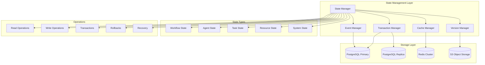

# DORA Compliance Agent State Management System

This module provides a robust state management system for tracking workflow execution, agent states, and system-wide state in the DORA Compliance Agent Orchestration Platform.

## Architecture Overview

### Core Principles
- **ACID Transactions**: Full transaction support with atomicity, consistency, isolation, and durability
- **Event Sourcing**: Complete audit trail through event-driven state changes
- **Multi-Level Caching**: Performance optimization with Redis and in-memory caching
- **State Versioning**: Version control for state changes with rollback capabilities
- **Conflict Resolution**: Optimistic and pessimistic locking strategies
- **High Availability**: Master-slave replication with automatic failover
- **Horizontal Scaling**: Sharding support for large-scale deployments

### State Management Architecture



## State Types and Models

### 1. Workflow State

Tracks the complete state of workflow executions including progress, dependencies, and metadata.

```json
{
  "workflow_id": "wf-uuid-12345",
  "definition_id": "dora-compliance-assessment",
  "version": "1.2.0",
  "state": "running",
  "created_at": "2024-01-17T10:00:00Z",
  "started_at": "2024-01-17T10:00:05Z",
  "updated_at": "2024-01-17T10:15:30Z",
  "scheduled_completion": "2024-01-17T11:00:00Z",
  "context": {
    "organization": "example-bank",
    "compliance_framework": "DORA",
    "triggered_by": "user@example.com",
    "priority": "high"
  },
  "tasks": {
    "task-1": {
      "state": "completed",
      "assigned_agent": "policy-analyzer-001",
      "start_time": "2024-01-17T10:00:10Z",
      "end_time": "2024-01-17T10:05:30Z",
      "outputs": {"compliance_score": 0.78}
    },
    "task-2": {
      "state": "running",
      "assigned_agent": "gap-assessment-001",
      "start_time": "2024-01-17T10:05:35Z",
      "inputs": {"compliance_score": 0.78}
    }
  },
  "metrics": {
    "total_tasks": 8,
    "completed_tasks": 1,
    "running_tasks": 1,
    "pending_tasks": 6,
    "progress_percentage": 12.5
  },
  "dependencies": {
    "satisfied": ["external-data-ready"],
    "pending": ["manual-approval"]
  },
  "error_info": null,
  "retry_count": 0,
  "max_retries": 3
}
```

### 2. Agent State

Maintains comprehensive state information for each agent including health, capacity, and current workload.

```json
{
  "agent_id": "policy-analyzer-001",
  "agent_type": "policy_analyzer",
  "instance_id": "pa-inst-001",
  "node_id": "k8s-node-3",
  "state": "healthy",
  "last_heartbeat": "2024-01-17T10:15:45Z",
  "registration_time": "2024-01-17T09:30:00Z",
  "capabilities": [
    "document_analysis",
    "policy_extraction",
    "compliance_scoring",
    "gap_identification"
  ],
  "resource_usage": {
    "cpu_percent": 65.2,
    "memory_percent": 78.1,
    "disk_percent": 45.0,
    "network_io": {"rx": 1024000, "tx": 512000},
    "gpu_utilization": 0.0
  },
  "capacity": {
    "max_concurrent_tasks": 5,
    "current_tasks": 2,
    "available_slots": 3,
    "queue_size": 1,
    "processing_rate": 2.3  // tasks per minute
  },
  "performance_metrics": {
    "tasks_completed": 127,
    "average_execution_time": 45.2,
    "success_rate": 0.985,
    "error_count": 2
  },
  "current_tasks": [
    {
      "task_id": "task-uuid-1",
      "workflow_id": "wf-uuid-12345",
      "start_time": "2024-01-17T10:05:35Z",
      "estimated_completion": "2024-01-17T10:08:00Z",
      "priority": "high"
    },
    {
      "task_id": "task-uuid-2", 
      "workflow_id": "wf-uuid-67890",
      "start_time": "2024-01-17T10:12:15Z",
      "estimated_completion": "2024-01-17T10:15:30Z",
      "priority": "medium"
    }
  ],
  "health_status": {
    "overall": "healthy",
    "checks": {
      "memory": "ok",
      "cpu": "warning",
      "disk": "ok",
      "network": "ok",
      "external_deps": "ok"
    },
    "last_health_check": "2024-01-17T10:15:40Z"
  },
  "configuration": {
    "version": "1.2.0",
    "config_hash": "sha256:abc123...",
    "last_config_update": "2024-01-17T09:00:00Z"
  }
}
```

### 3. Task State

Detailed tracking of individual task execution state and lifecycle.

```json
{
  "task_id": "task-uuid-12345",
  "workflow_id": "wf-uuid-67890",
  "definition_id": "document_analysis",
  "state": "running",
  "created_at": "2024-01-17T10:00:00Z",
  "scheduled_at": "2024-01-17T10:00:05Z",
  "started_at": "2024-01-17T10:00:10Z",
  "updated_at": "2024-01-17T10:05:30Z",
  "estimated_completion": "2024-01-17T10:08:00Z",
  "assigned_agent": {
    "agent_id": "policy-analyzer-001",
    "assigned_at": "2024-01-17T10:00:08Z",
    "assignment_reason": "capability_match"
  },
  "dependencies": {
    "required": ["task-uuid-11111"],
    "satisfied": ["task-uuid-11111"],
    "blocked_by": []
  },
  "inputs": {
    "documents": ["policy.pdf", "framework.pdf"],
    "analysis_type": "comprehensive",
    "parameters": {"depth": "detailed"}
  },
  "outputs": {
    "compliance_score": 0.78,
    "gaps_identified": 5,
    "recommendations": ["update_policy", "automate_testing"]
  },
  "progress": {
    "percentage": 60.0,
    "current_phase": "analysis",
    "phases_completed": ["preparation", "parsing"],
    "phases_remaining": ["analysis", "reporting"]
  },
  "resource_requirements": {
    "cpu": "2",
    "memory": "4Gi",
    "storage": "10Gi",
    "timeout": 300
  },
  "resource_allocation": {
    "allocated_cpu": "2",
    "allocated_memory": "4Gi",
    "allocated_storage": "10Gi",
    "allocation_id": "alloc-uuid-123"
  },
  "execution_metrics": {
    "start_delay": 5.2,  // seconds from scheduled to started
    "execution_time": 85.3,  // seconds so far
    "memory_peak": "3.2Gi",
    "cpu_average": 1.8
  },
  "retry_info": {
    "attempt": 1,
    "max_attempts": 3,
    "retry_count": 0,
    "last_error": null
  },
  "audit_trail": [
    {
      "timestamp": "2024-01-17T10:00:00Z",
      "event": "task_created",
      "actor": "workflow_engine",
      "details": {"workflow_id": "wf-uuid-67890"}
    },
    {
      "timestamp": "2024-01-17T10:00:08Z",
      "event": "agent_assigned",
      "actor": "scheduler",
      "details": {"agent_id": "policy-analyzer-001"}
    },
    {
      "timestamp": "2024-01-17T10:00:10Z",
      "event": "execution_started",
      "actor": "policy-analyzer-001",
      "details": {"resource_allocation": "alloc-uuid-123"}
    }
  ]
}
```

### 4. Resource State

Tracking of computational and data resources allocation and utilization.

```json
{
  "resource_pool_id": "compute-pool-primary",
  "last_updated": "2024-01-17T10:15:45Z",
  "total_capacity": {
    "cpu_cores": 1000,
    "memory_gb": 4000,
    "storage_gb": 50000,
    "gpu_units": 20
  },
  "available_capacity": {
    "cpu_cores": 234,
    "memory_gb": 890,
    "storage_gb": 12000,
    "gpu_units": 15
  },
  "allocated_resources": {
    "cpu_cores": 766,
    "memory_gb": 3110,
    "storage_gb": 38000,
    "gpu_units": 5
  },
  "reservations": [
    {
      "reservation_id": "res-uuid-123",
      "task_id": "task-uuid-456",
      "agent_id": "policy-analyzer-001",
      "resources": {"cpu": "2", "memory": "4Gi"},
      "created_at": "2024-01-17T10:00:05Z",
      "expires_at": "2024-01-17T10:30:00Z",
      "state": "active"
    }
  ],
  "utilization_metrics": {
    "cpu_utilization": 76.6,
    "memory_utilization": 77.75,
    "storage_utilization": 76.0,
    "gpu_utilization": 25.0
  },
  "allocation_policies": {
    "cpu_overcommit_ratio": 1.5,
    "memory_overcommit_ratio": 1.2,
    "priority_weights": {"high": 10, "medium": 5, "low": 1}
  }
}
```

### 5. System State

Overall system health and configuration state.

```json
{
  "system_id": "dora-compliance-platform",
  "environment": "production", 
  "version": "1.2.0",
  "deployment_id": "deploy-2024-01-17-001",
  "last_updated": "2024-01-17T10:15:50Z",
  "overall_health": "healthy",
  "component_health": {
    "workflow_engine": "healthy",
    "state_manager": "healthy", 
    "communication_layer": "healthy",
    "monitoring_system": "warning",
    "database": "healthy",
    "cache": "healthy",
    "message_queue": "healthy"
  },
  "active_workflows": 45,
  "active_agents": 28,
  "pending_tasks": 156,
  "running_tasks": 89,
  "completed_tasks_today": 2341,
  "error_rate": 0.012,
  "average_response_time": 2.3,
  "throughput": {
    "tasks_per_minute": 15.7,
    "workflows_per_hour": 12.3
  },
  "resource_summary": {
    "total_cpu_utilization": 68.5,
    "total_memory_utilization": 72.1,
    "total_storage_utilization": 45.8
  },
  "configuration": {
    "max_concurrent_workflows": 100,
    "max_workflow_duration": 3600,
    "default_timeout": 300,
    "retry_attempts": 3
  },
  "maintenance_windows": [
    {
      "start": "2024-01-18T02:00:00Z",
      "end": "2024-01-18T04:00:00Z",
      "type": "scheduled",
      "description": "Database maintenance"
    }
  ]
}
```

## State Operations

### 1. Atomic Transactions

All state modifications are wrapped in ACID transactions to ensure data consistency.

```python
async def update_workflow_with_task_completion(
    workflow_id: str, 
    task_id: str, 
    task_result: TaskResult
) -> bool:
    async with state_manager.transaction() as txn:
        # Update task state
        await txn.update_task_state(task_id, TaskState.COMPLETED)
        await txn.set_task_outputs(task_id, task_result.outputs)
        
        # Update workflow progress
        workflow = await txn.get_workflow(workflow_id)
        workflow.completed_tasks += 1
        workflow.progress = workflow.completed_tasks / workflow.total_tasks
        
        # Check if workflow is complete
        if workflow.progress >= 1.0:
            workflow.state = WorkflowState.COMPLETED
            workflow.completed_at = datetime.utcnow()
            
        await txn.update_workflow(workflow)
        
        # Commit transaction
        await txn.commit()
```

### 2. State Versioning and History

Every state change creates a new version with complete history tracking.

```python
# Get current state
current_state = await state_manager.get_workflow_state(workflow_id)

# Get specific version
version_3_state = await state_manager.get_workflow_state(
    workflow_id, 
    version=3
)

# Get state at specific time
historical_state = await state_manager.get_workflow_state(
    workflow_id,
    at_time=datetime(2024, 1, 17, 10, 0, 0)
)

# Get all versions
version_history = await state_manager.get_workflow_history(workflow_id)
```

### 3. Optimistic Concurrency Control

Prevents conflicts using version-based optimistic locking.

```python
# Read with version
workflow, version = await state_manager.get_workflow_with_version(workflow_id)

# Modify state
workflow.status = "updated"

# Update with version check
try:
    await state_manager.update_workflow(workflow, expected_version=version)
except OptimisticLockException:
    # Handle conflict - reload and retry
    logger.warning(f"Optimistic lock failed for workflow {workflow_id}")
    # Retry logic here
```

### 4. Pessimistic Locking

For critical operations requiring exclusive access.

```python
# Acquire exclusive lock
async with state_manager.exclusive_lock(f"workflow:{workflow_id}"):
    workflow = await state_manager.get_workflow(workflow_id)
    
    # Critical section - no other process can modify this workflow
    workflow.critical_field = new_value
    
    await state_manager.update_workflow(workflow)
    
    # Lock automatically released
```

### 5. Rollback Operations

Support for rolling back state changes to previous versions.

```python
# Rollback to previous version
await state_manager.rollback_workflow(workflow_id, to_version=5)

# Rollback to specific time
await state_manager.rollback_workflow(
    workflow_id,
    to_time=datetime(2024, 1, 17, 9, 30, 0)
)

# Rollback with audit trail
await state_manager.rollback_workflow(
    workflow_id,
    to_version=3,
    reason="Data corruption detected",
    operator="admin@company.com"
)
```

## Caching Strategy

### Multi-Level Caching Architecture

1. **L1 Cache (In-Memory)**: Ultra-fast access for frequently accessed state
2. **L2 Cache (Redis)**: Distributed cache for shared state across instances
3. **L3 Cache (Database)**: Persistent storage with query optimization

```python
# Cache hierarchy example
async def get_workflow_state(workflow_id: str) -> WorkflowState:
    # L1: Check in-memory cache
    if state := self.l1_cache.get(f"workflow:{workflow_id}"):
        return state
    
    # L2: Check Redis cache  
    if state := await self.redis.get(f"workflow:{workflow_id}"):
        self.l1_cache.set(f"workflow:{workflow_id}", state, ttl=300)
        return state
    
    # L3: Load from database
    state = await self.database.get_workflow(workflow_id)
    
    # Populate caches
    await self.redis.setex(f"workflow:{workflow_id}", 3600, state)
    self.l1_cache.set(f"workflow:{workflow_id}", state, ttl=300)
    
    return state
```

### Cache Invalidation

Smart cache invalidation based on state dependencies and change patterns.

```python
async def invalidate_dependent_caches(entity_type: str, entity_id: str):
    """Invalidate caches for entities that depend on the changed entity"""
    
    if entity_type == "task":
        # Invalidate workflow cache when task changes
        task = await self.get_task(entity_id)
        await self.invalidate_cache("workflow", task.workflow_id)
        
        # Invalidate agent cache if task assignment changes
        if task.assigned_agent:
            await self.invalidate_cache("agent", task.assigned_agent)
            
    elif entity_type == "agent":
        # Invalidate all tasks assigned to this agent
        assigned_tasks = await self.get_tasks_by_agent(entity_id)
        for task in assigned_tasks:
            await self.invalidate_cache("task", task.id)
```

## Event Sourcing

Complete audit trail through event-driven state changes.

### Event Storage

```python
@dataclass
class StateChangeEvent:
    event_id: str
    entity_type: str  # workflow, task, agent, etc.
    entity_id: str
    event_type: str  # created, updated, deleted, etc.
    timestamp: datetime
    version: int
    data: Dict[str, Any]
    metadata: Dict[str, Any]
    actor: str  # who made the change
    
    def to_dict(self) -> Dict[str, Any]:
        return {
            'event_id': self.event_id,
            'entity_type': self.entity_type,
            'entity_id': self.entity_id,
            'event_type': self.event_type,
            'timestamp': self.timestamp.isoformat(),
            'version': self.version,
            'data': self.data,
            'metadata': self.metadata,
            'actor': self.actor
        }
```

### State Reconstruction

```python
async def reconstruct_state_from_events(
    entity_type: str, 
    entity_id: str,
    up_to_version: Optional[int] = None
) -> Dict[str, Any]:
    """Reconstruct entity state from event history"""
    
    events = await self.event_store.get_events(
        entity_type=entity_type,
        entity_id=entity_id,
        up_to_version=up_to_version
    )
    
    state = {}
    for event in events:
        state = self.apply_event_to_state(state, event)
    
    return state
```

## Performance Optimization

### Database Optimization

1. **Indexing Strategy**: Optimized indexes for common query patterns
2. **Partitioning**: Time-based partitioning for event tables
3. **Connection Pooling**: Efficient database connection management
4. **Read Replicas**: Separate read/write workloads

### Caching Optimization

1. **Cache Warming**: Pre-populate frequently accessed data
2. **Cache Compression**: Reduce memory usage with compression
3. **TTL Optimization**: Dynamic TTL based on access patterns
4. **Cache Metrics**: Monitor hit rates and performance

### Memory Management

1. **Object Pooling**: Reuse objects to reduce GC pressure
2. **Lazy Loading**: Load state components on demand
3. **Memory Profiling**: Continuous memory usage monitoring
4. **Garbage Collection**: Optimized GC settings

## Monitoring and Observability

### Key Metrics

1. **State Operations**: Read/write operations per second
2. **Cache Performance**: Hit rates, miss rates, latency
3. **Transaction Performance**: Transaction duration, rollback rates
4. **Lock Contention**: Lock wait times, deadlock detection
5. **Storage Usage**: Database size, growth rates

### Health Checks

```python
async def health_check() -> HealthStatus:
    """Comprehensive health check for state management"""
    
    checks = {}
    
    # Database connectivity
    checks['database'] = await self._check_database_health()
    
    # Cache connectivity  
    checks['cache'] = await self._check_cache_health()
    
    # Transaction performance
    checks['transactions'] = await self._check_transaction_health()
    
    # Memory usage
    checks['memory'] = await self._check_memory_usage()
    
    # Disk usage
    checks['disk'] = await self._check_disk_usage()
    
    overall_status = 'healthy' if all(
        check['status'] == 'healthy' for check in checks.values()
    ) else 'degraded'
    
    return HealthStatus(
        overall=overall_status,
        checks=checks,
        timestamp=datetime.utcnow()
    )
```

## Recovery and Backup

### Backup Strategy

1. **Continuous Backup**: Real-time replication to backup database
2. **Point-in-Time Recovery**: Restore to any point in time
3. **Snapshot Backups**: Regular full system snapshots
4. **Cross-Region Replication**: Geographic redundancy

### Disaster Recovery

1. **Automated Failover**: Automatic promotion of replica databases
2. **Recovery Testing**: Regular disaster recovery drills
3. **RTO/RPO Targets**: Recovery time and data loss objectives
4. **Rollback Procedures**: Quick rollback for failed deployments

This state management system provides a robust, scalable, and highly available foundation for tracking all aspects of the DORA compliance platform's state, ensuring data consistency, performance, and reliability. 