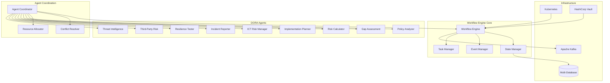

# DORA Compliance Agent Orchestration Platform - Workflow Engine

The Workflow Engine is the central orchestration component that coordinates all DORA compliance agents using a state machine-based architecture built on LangGraph and LangChain.

## Architecture Overview

### Core Principles
- **Event-Driven Architecture**: Asynchronous processing with event sourcing
- **State Machine Design**: Predictable workflow execution with clear state transitions
- **Agent Autonomy**: Agents operate independently while coordinating through the engine
- **Fault Tolerance**: Resilient design with error recovery and retry mechanisms
- **Scalability**: Horizontal scaling with stateless execution nodes
- **DORA Compliance**: Built-in regulatory compliance tracking and audit trails

### System Components



## Workflow Engine Architecture

### 1. Core Engine Components

#### Workflow Engine Controller
```python
class WorkflowEngine:
    """
    Central workflow orchestration engine
    
    Responsibilities:
    - Workflow lifecycle management
    - Agent coordination and communication
    - State transition orchestration
    - Event processing and routing
    - Resource allocation and management
    """
    
    def __init__(self, config: WorkflowConfig):
        self.state_manager = StateManager(config.state_config)
        self.event_manager = EventManager(config.event_config)
        self.task_manager = TaskManager(config.task_config)
        self.agent_coordinator = AgentCoordinator(config.agent_config)
        self.resource_allocator = ResourceAllocator(config.resource_config)
```

#### State Machine Design
```python
from enum import Enum
from typing import Dict, List, Optional
from dataclasses import dataclass

class WorkflowState(Enum):
    """Workflow execution states"""
    CREATED = "created"
    QUEUED = "queued"
    RUNNING = "running"
    WAITING = "waiting"
    COMPLETED = "completed"
    FAILED = "failed"
    CANCELLED = "cancelled"
    PAUSED = "paused"

class AgentState(Enum):
    """Individual agent states"""
    IDLE = "idle"
    ASSIGNED = "assigned"
    PROCESSING = "processing"
    BLOCKED = "blocked"
    COMPLETED = "completed"
    ERROR = "error"

@dataclass
class WorkflowDefinition:
    """Defines a complete workflow structure"""
    id: str
    name: str
    description: str
    version: str
    tasks: List['TaskDefinition']
    dependencies: Dict[str, List[str]]
    triggers: List['TriggerDefinition']
    timeout: Optional[int] = None
    retry_policy: Optional['RetryPolicy'] = None
```

### 2. Workflow Definition Format

#### YAML-Based Workflow Definition
```yaml
# dora-compliance-assessment.yaml
workflow:
  id: "dora-compliance-assessment"
  name: "DORA Compliance Assessment"
  description: "Complete DORA regulatory compliance assessment workflow"
  version: "1.0.0"
  
  # Global configuration
  config:
    timeout: 3600  # 1 hour
    max_retries: 3
    parallel_execution: true
    audit_enabled: true
    
  # Workflow triggers
  triggers:
    - type: "manual"
      name: "user_initiated"
    - type: "scheduled"
      name: "quarterly_review"
      schedule: "0 0 1 */3 *"  # First day of every quarter
    - type: "event"
      name: "policy_update"
      event_type: "policy.updated"
  
  # Task definitions
  tasks:
    - id: "document_analysis"
      name: "Analyze Policy Documents"
      agent: "policy_analyzer"
      config:
        timeout: 900
        priority: "high"
        resources:
          cpu: "2"
          memory: "4Gi"
          gpu: false
      inputs:
        - name: "documents"
          type: "file_list"
          required: true
        - name: "analysis_type"
          type: "string"
          default: "comprehensive"
      outputs:
        - name: "analysis_results"
          type: "structured_data"
        - name: "compliance_score"
          type: "numeric"
    
    - id: "gap_identification"
      name: "Identify Compliance Gaps"
      agent: "gap_assessment"
      depends_on: ["document_analysis"]
      config:
        timeout: 600
        priority: "high"
      inputs:
        - name: "analysis_results"
          from_task: "document_analysis"
          field: "analysis_results"
      outputs:
        - name: "gaps_identified"
          type: "structured_data"
        - name: "risk_assessment"
          type: "structured_data"
    
    - id: "risk_calculation"
      name: "Calculate Financial Risk"
      agent: "risk_calculator"
      depends_on: ["gap_identification"]
      config:
        timeout: 300
        priority: "medium"
      inputs:
        - name: "gaps_data"
          from_task: "gap_identification"
          field: "gaps_identified"
        - name: "financial_data"
          type: "external_api"
          source: "financial_system"
      outputs:
        - name: "risk_metrics"
          type: "structured_data"
        - name: "financial_impact"
          type: "numeric"
    
    - id: "implementation_planning"
      name: "Generate Implementation Plan"
      agent: "implementation_planner"
      depends_on: ["gap_identification", "risk_calculation"]
      config:
        timeout: 1200
        priority: "medium"
      inputs:
        - name: "gaps_data"
          from_task: "gap_identification"
          field: "gaps_identified"
        - name: "risk_data"
          from_task: "risk_calculation"
          field: "risk_metrics"
      outputs:
        - name: "implementation_plan"
          type: "structured_data"
        - name: "timeline"
          type: "structured_data"
    
    - id: "report_generation"
      name: "Generate Compliance Report"
      agent: "report_generator"
      depends_on: ["document_analysis", "gap_identification", "risk_calculation", "implementation_planning"]
      config:
        timeout: 300
        priority: "low"
      inputs:
        - name: "all_results"
          type: "aggregated"
          sources: ["document_analysis", "gap_identification", "risk_calculation", "implementation_planning"]
      outputs:
        - name: "compliance_report"
          type: "document"
        - name: "executive_summary"
          type: "document"

  # Workflow routing and conditions
  routing:
    - condition: "task.document_analysis.outputs.compliance_score < 0.5"
      action: "escalate"
      target: "compliance_officer"
      
    - condition: "task.risk_calculation.outputs.financial_impact > 1000000"
      action: "require_approval"
      approvers: ["cfo", "cro"]
      
    - condition: "workflow.duration > 7200"  # 2 hours
      action: "alert"
      recipients: ["ops_team"]

  # Error handling
  error_handling:
    - error_type: "agent_timeout"
      action: "retry"
      max_attempts: 3
      backoff: "exponential"
      
    - error_type: "resource_unavailable"
      action: "queue"
      wait_strategy: "exponential_backoff"
      
    - error_type: "data_validation_error"
      action: "halt"
      notify: ["data_team", "workflow_owner"]

  # Success criteria
  success_criteria:
    - condition: "all_tasks_completed"
      required: true
    - condition: "compliance_score >= 0.7"
      required: true
    - condition: "no_critical_gaps"
      required: false
```

### 3. Event-Driven Architecture

#### Event Types and Structure
```python
from enum import Enum
from datetime import datetime
from typing import Any, Dict, Optional
from dataclasses import dataclass, field

class EventType(Enum):
    """Core event types in the system"""
    WORKFLOW_CREATED = "workflow.created"
    WORKFLOW_STARTED = "workflow.started"
    WORKFLOW_COMPLETED = "workflow.completed"
    WORKFLOW_FAILED = "workflow.failed"
    TASK_STARTED = "task.started"
    TASK_COMPLETED = "task.completed"
    TASK_FAILED = "task.failed"
    AGENT_ASSIGNED = "agent.assigned"
    AGENT_AVAILABLE = "agent.available"
    AGENT_ERROR = "agent.error"
    RESOURCE_ALLOCATED = "resource.allocated"
    RESOURCE_RELEASED = "resource.released"
    COMPLIANCE_ALERT = "compliance.alert"
    AUDIT_LOG = "audit.log"

@dataclass
class WorkflowEvent:
    """Base event structure for all workflow events"""
    id: str
    type: EventType
    workflow_id: str
    timestamp: datetime
    source: str
    data: Dict[str, Any]
    correlation_id: Optional[str] = None
    causation_id: Optional[str] = None
    metadata: Dict[str, Any] = field(default_factory=dict)
    
    def to_dict(self) -> Dict[str, Any]:
        """Convert event to dictionary for serialization"""
        return {
            'id': self.id,
            'type': self.type.value,
            'workflow_id': self.workflow_id,
            'timestamp': self.timestamp.isoformat(),
            'source': self.source,
            'data': self.data,
            'correlation_id': self.correlation_id,
            'causation_id': self.causation_id,
            'metadata': self.metadata
        }
```

#### Event Processing Pipeline
```python
class EventProcessor:
    """Processes and routes workflow events"""
    
    def __init__(self, config: EventConfig):
        self.handlers: Dict[EventType, List[Callable]] = {}
        self.middleware: List[Callable] = []
        self.dead_letter_queue = DeadLetterQueue(config.dlq_config)
        
    async def process_event(self, event: WorkflowEvent) -> None:
        """Process a single event through the pipeline"""
        try:
            # Apply middleware
            for middleware in self.middleware:
                event = await middleware(event)
                
            # Route to handlers
            handlers = self.handlers.get(event.type, [])
            for handler in handlers:
                await handler(event)
                
        except Exception as e:
            await self.dead_letter_queue.add(event, error=str(e))
            raise
```

### 4. Agent Integration Architecture

#### Agent Interface Definition
```python
from abc import ABC, abstractmethod
from typing import Dict, Any, List, Optional

class DORAAgent(ABC):
    """Base interface for all DORA compliance agents"""
    
    @abstractmethod
    async def execute_task(self, task: 'TaskExecution') -> 'TaskResult':
        """Execute a specific task"""
        pass
    
    @abstractmethod
    async def get_capabilities(self) -> List[str]:
        """Return list of capabilities this agent provides"""
        pass
    
    @abstractmethod
    async def health_check(self) -> 'HealthStatus':
        """Perform health check and return status"""
        pass
    
    @abstractmethod
    async def get_resource_requirements(self, task: 'TaskDefinition') -> 'ResourceRequirements':
        """Get resource requirements for a specific task"""
        pass
    
    @property
    @abstractmethod
    def agent_id(self) -> str:
        """Unique identifier for this agent"""
        pass
    
    @property
    @abstractmethod
    def agent_type(self) -> str:
        """Type/category of this agent"""
        pass
```

#### Agent Coordinator
```python
class AgentCoordinator:
    """Coordinates agent lifecycle and task assignment"""
    
    def __init__(self, config: CoordinatorConfig):
        self.agents: Dict[str, DORAAgent] = {}
        self.agent_registry = AgentRegistry(config.registry_config)
        self.load_balancer = AgentLoadBalancer(config.load_balancer_config)
        self.health_monitor = AgentHealthMonitor(config.health_config)
        
    async def register_agent(self, agent: DORAAgent) -> None:
        """Register a new agent with the coordinator"""
        self.agents[agent.agent_id] = agent
        await self.agent_registry.register(agent)
        await self.health_monitor.start_monitoring(agent)
        
    async def assign_task(self, task: 'TaskExecution') -> str:
        """Assign a task to the most suitable agent"""
        suitable_agents = await self.find_suitable_agents(task)
        selected_agent = await self.load_balancer.select_agent(suitable_agents, task)
        
        await self.execute_task_on_agent(selected_agent, task)
        return selected_agent.agent_id
```

### 5. Execution Model

#### Task Execution Pipeline
```python
class TaskExecutor:
    """Handles individual task execution within workflows"""
    
    async def execute_task(self, task_execution: TaskExecution) -> TaskResult:
        """Execute a single task with full lifecycle management"""
        
        # 1. Validate task inputs
        await self.validate_inputs(task_execution)
        
        # 2. Allocate resources
        resources = await self.resource_allocator.allocate(
            task_execution.resource_requirements
        )
        
        try:
            # 3. Assign to agent
            agent = await self.agent_coordinator.assign_task(task_execution)
            
            # 4. Execute with monitoring
            result = await self.execute_with_monitoring(agent, task_execution)
            
            # 5. Validate outputs
            await self.validate_outputs(result)
            
            return result
            
        finally:
            # 6. Release resources
            await self.resource_allocator.release(resources)
```

### 6. State Management

#### Persistent State Storage
```python
class StateManager:
    """Manages workflow and task state persistence"""
    
    def __init__(self, config: StateConfig):
        self.state_store = StateStore(config.store_config)
        self.cache = StateCache(config.cache_config)
        self.version_manager = StateVersionManager(config.version_config)
        
    async def save_workflow_state(self, workflow_id: str, state: WorkflowState) -> None:
        """Save workflow state with versioning"""
        version = await self.version_manager.create_version(workflow_id, state)
        await self.state_store.save(workflow_id, state, version)
        await self.cache.update(workflow_id, state)
        
    async def get_workflow_state(self, workflow_id: str) -> Optional[WorkflowState]:
        """Retrieve current workflow state"""
        # Try cache first
        state = await self.cache.get(workflow_id)
        if state is None:
            state = await self.state_store.load(workflow_id)
            if state:
                await self.cache.set(workflow_id, state)
        return state
```

### 7. Workflow Versioning and Lifecycle

#### Version Management
```python
@dataclass
class WorkflowVersion:
    """Represents a specific version of a workflow definition"""
    workflow_id: str
    version: str
    definition: WorkflowDefinition
    created_at: datetime
    created_by: str
    status: str  # draft, active, deprecated, archived
    changelog: List[str]
    
class WorkflowVersionManager:
    """Manages workflow definition versions"""
    
    async def create_version(self, definition: WorkflowDefinition) -> WorkflowVersion:
        """Create a new version of a workflow definition"""
        pass
        
    async def activate_version(self, workflow_id: str, version: str) -> None:
        """Activate a specific version for execution"""
        pass
        
    async def migrate_running_workflows(self, workflow_id: str, 
                                      from_version: str, 
                                      to_version: str) -> None:
        """Migrate running workflows to a new version"""
        pass
```

## Integration Points

### 1. Infrastructure Integration

#### Kubernetes Integration
- **Deployment**: Workflow engine runs as a Kubernetes deployment with horizontal pod autoscaling
- **Service Discovery**: Agents register through Kubernetes services
- **Resource Management**: Kubernetes resource quotas and limits
- **Health Checks**: Kubernetes liveness and readiness probes

#### Apache Kafka Integration
- **Event Streaming**: All workflow events published to Kafka topics
- **Agent Communication**: Inter-agent messages via Kafka
- **Audit Logging**: Compliance events for regulatory requirements
- **Dead Letter Queues**: Failed message handling

#### Database Integration
- **PostgreSQL**: Primary workflow metadata and state storage
- **Redis**: Caching and session management
- **MongoDB**: Document storage for workflow definitions and results
- **Neo4j**: Dependency graph analysis and workflow optimization

### 2. Security Integration

#### HashiCorp Vault Integration
- **Secret Management**: API keys, database credentials, encryption keys
- **Dynamic Secrets**: Temporary credentials for agents
- **Audit Logging**: Access logging for compliance
- **Encryption**: Transit and storage encryption key management

#### Zero-Trust Security
- **mTLS**: All inter-service communication encrypted
- **JWT Tokens**: Agent authentication and authorization
- **RBAC**: Role-based access control for workflow operations
- **Network Policies**: Kubernetes network segmentation

## Configuration Examples

### Environment Configuration
```yaml
# production.yaml
workflow_engine:
  deployment:
    replicas: 3
    resources:
      cpu: "2"
      memory: "4Gi"
    
  state_management:
    backend: "postgresql"
    connection_pool_size: 20
    cache_ttl: 3600
    
  event_processing:
    kafka_brokers: ["kafka-1:9092", "kafka-2:9092", "kafka-3:9092"]
    consumer_group: "workflow-engine"
    batch_size: 100
    
  agent_coordination:
    discovery_method: "kubernetes"
    health_check_interval: 30
    load_balancing: "round_robin"
    
  security:
    vault_address: "https://vault.dora-system.svc.cluster.local:8200"
    tls_enabled: true
    rbac_enabled: true
    
  monitoring:
    metrics_enabled: true
    tracing_enabled: true
    log_level: "info"
```

### Agent Configuration
```yaml
# policy-analyzer-agent.yaml
agent:
  id: "policy-analyzer-001"
  type: "policy_analyzer"
  version: "1.2.0"
  
  capabilities:
    - "document_analysis"
    - "policy_extraction"
    - "compliance_scoring"
    - "gap_identification"
    
  resources:
    cpu_limit: "4"
    memory_limit: "8Gi"
    gpu_required: false
    
  configuration:
    models:
      primary: "claude-3-sonnet"
      fallback: "gpt-4"
    processing:
      batch_size: 10
      timeout: 900
    
  health_check:
    endpoint: "/health"
    interval: 30
    timeout: 10
```

## Performance and Scalability

### Horizontal Scaling
- **Stateless Execution**: Workflow engine nodes are stateless for easy scaling
- **Event Partitioning**: Kafka topic partitioning for parallel processing
- **Agent Pool Management**: Dynamic agent pool scaling based on demand
- **Database Sharding**: Workflow data partitioned by tenant/organization

### Performance Optimizations
- **Caching Strategy**: Multi-level caching (Redis, in-memory, CDN)
- **Connection Pooling**: Database and HTTP connection pooling
- **Async Processing**: Non-blocking I/O throughout the system
- **Batch Operations**: Bulk processing for efficiency

### Resource Management
- **CPU/Memory Limits**: Kubernetes resource constraints
- **Queue Management**: Priority queues for urgent compliance tasks
- **Throttling**: Rate limiting to prevent resource exhaustion
- **Monitoring**: Real-time resource usage tracking

## Compliance and Audit

### DORA Compliance Features
- **Audit Trails**: Complete workflow execution history
- **Data Lineage**: Track data flow through compliance processes
- **Retention Policies**: Automated data retention and archival
- **Access Logging**: Complete access control audit logs

### Regulatory Reporting
- **Automated Reports**: Scheduled compliance status reports
- **Real-time Dashboards**: Executive compliance overview
- **Incident Tracking**: Compliance violation detection and response
- **Change Management**: Workflow change approval and tracking

## Deployment and Operations

### Container Images
```dockerfile
# workflow-engine/Dockerfile
FROM python:3.11-slim

# Install dependencies
COPY requirements.txt .
RUN pip install -r requirements.txt

# Copy application
COPY src/ /app/
WORKDIR /app

# Security
RUN adduser --system --no-create-home workflow
USER workflow

# Health check
HEALTHCHECK --interval=30s --timeout=10s --retries=3 \
  CMD python -c "import requests; requests.get('http://localhost:8080/health')"

EXPOSE 8080
CMD ["python", "main.py"]
```

### Kubernetes Deployment
```yaml
# k8s/workflow-engine-deployment.yaml
apiVersion: apps/v1
kind: Deployment
metadata:
  name: workflow-engine
  namespace: dora-system
spec:
  replicas: 3
  selector:
    matchLabels:
      app: workflow-engine
  template:
    metadata:
      labels:
        app: workflow-engine
    spec:
      containers:
      - name: workflow-engine
        image: dora/workflow-engine:1.0.0
        ports:
        - containerPort: 8080
        env:
        - name: DB_HOST
          valueFrom:
            secretKeyRef:
              name: db-credentials
              key: host
        resources:
          requests:
            cpu: "1"
            memory: "2Gi"
          limits:
            cpu: "2"
            memory: "4Gi"
        livenessProbe:
          httpGet:
            path: /health
            port: 8080
          initialDelaySeconds: 30
          periodSeconds: 30
        readinessProbe:
          httpGet:
            path: /ready
            port: 8080
          initialDelaySeconds: 5
          periodSeconds: 5
```

This workflow engine architecture provides a robust, scalable, and compliant foundation for orchestrating DORA compliance agents while maintaining enterprise-grade security, observability, and operational characteristics. 