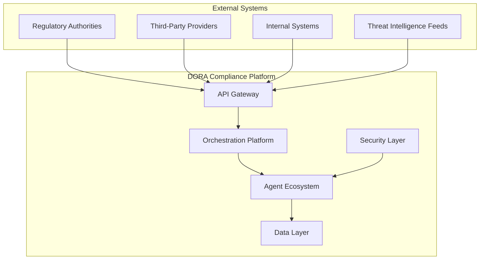
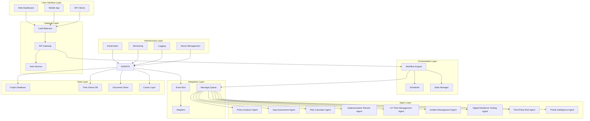
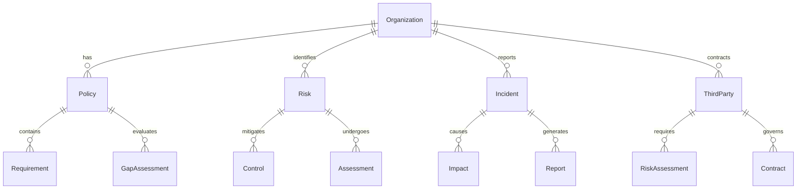
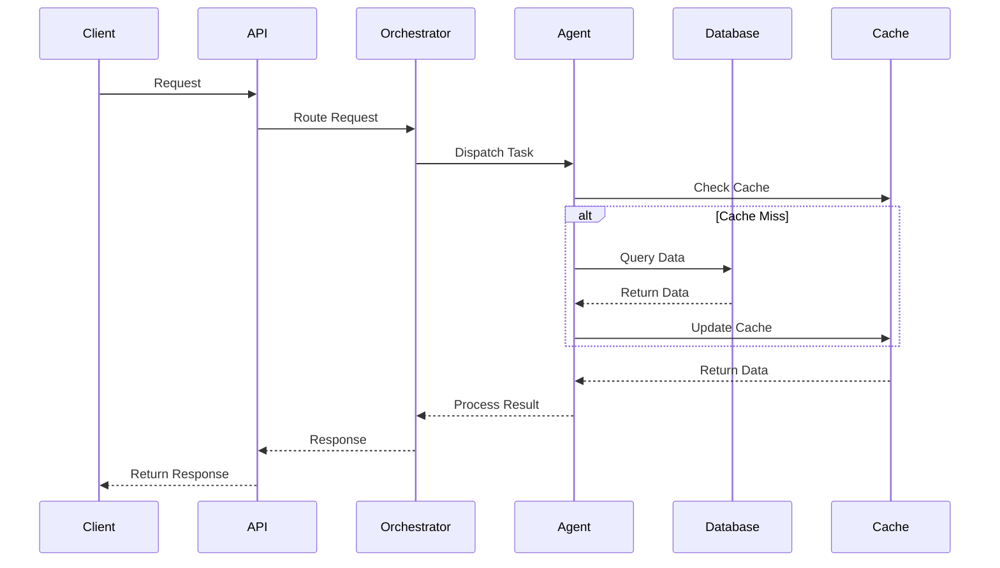
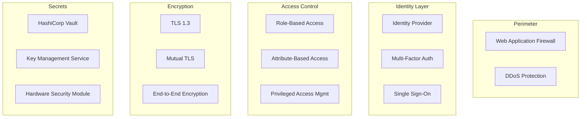
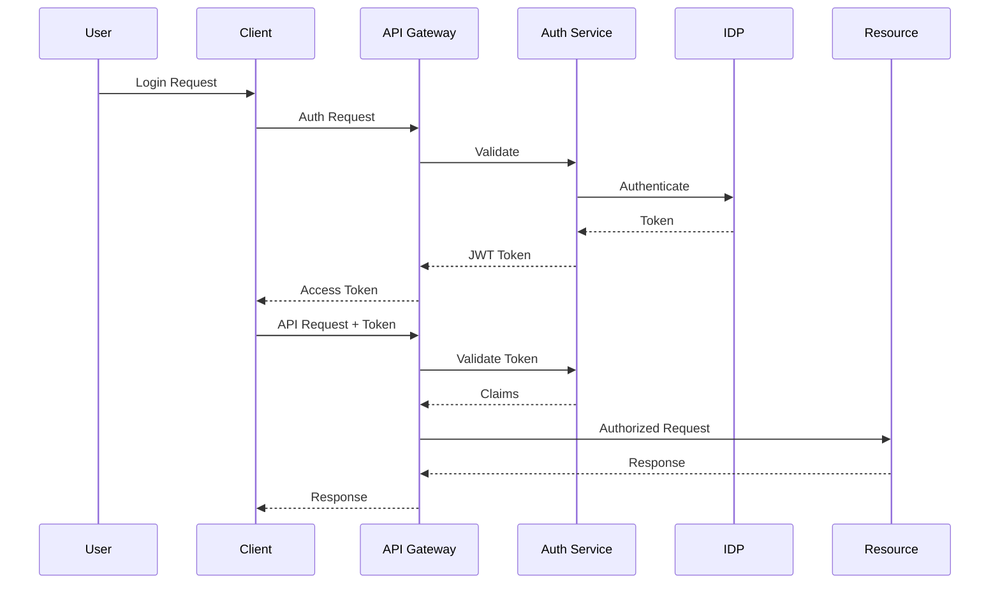
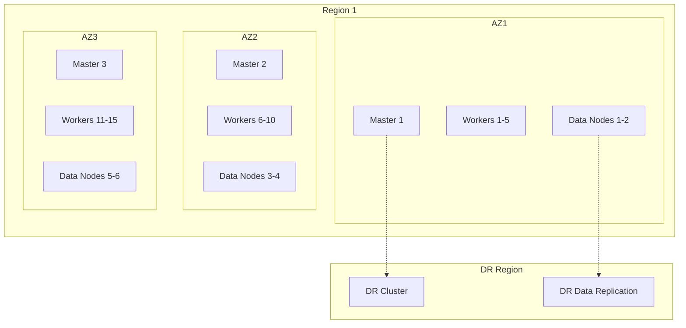
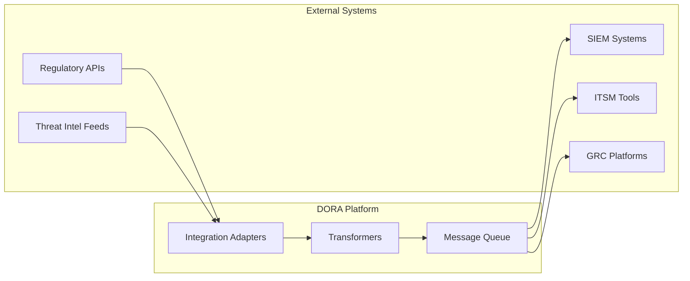
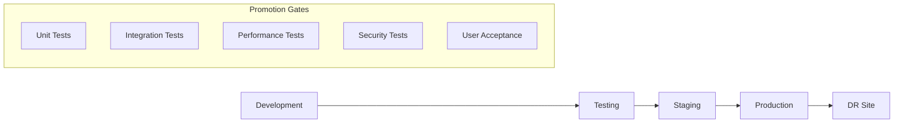
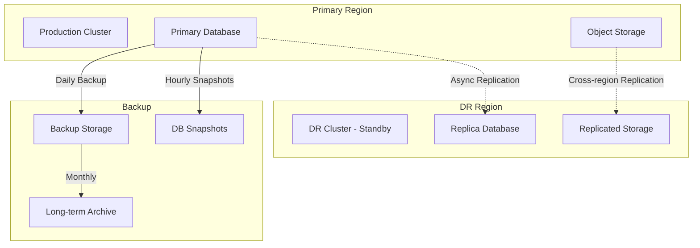

# DORA Compliance Multi-Agent System Architecture

## Document Version
- **Version**: 1.0.0
- **Date**: December 2024
- **Status**: Draft
- **Authors**: System Architecture Team

## Table of Contents
1. [Executive Summary](#executive-summary)
2. [System Overview](#system-overview)
3. [Architecture Principles](#architecture-principles)
4. [High-Level Architecture](#high-level-architecture)
5. [Component Architecture](#component-architecture)
6. [Data Architecture](#data-architecture)
7. [Security Architecture](#security-architecture)
8. [Infrastructure Architecture](#infrastructure-architecture)
9. [Integration Architecture](#integration-architecture)
10. [Deployment Architecture](#deployment-architecture)
11. [Scalability & Performance](#scalability--performance)
12. [Disaster Recovery](#disaster-recovery)
13. [Technology Stack](#technology-stack)
14. [API Specifications](#api-specifications)
15. [Decision Log](#decision-log)

## Executive Summary

The DORA Compliance Multi-Agent System is designed as a cloud-native, microservices-based platform that leverages autonomous AI agents to ensure comprehensive compliance with the Digital Operational Resilience Act (DORA) regulations. The system employs a distributed architecture with multiple specialized agents working in concert through an orchestration platform.

### Key Architectural Highlights
- **Multi-Agent Architecture**: Specialized AI agents for different DORA compliance aspects
- **Event-Driven Design**: Asynchronous communication via message queuing
- **Cloud-Native**: Kubernetes-based deployment with horizontal scalability
- **Zero-Trust Security**: End-to-end encryption and mutual TLS
- **Resilient Design**: Built-in fault tolerance and disaster recovery

## System Overview

### Business Context
The system addresses the complex requirements of DORA compliance across five key pillars:
1. ICT Risk Management
2. ICT Incident Reporting
3. Digital Operational Resilience Testing
4. ICT Third-Party Risk Management
5. Information Sharing

### System Boundaries


## Architecture Principles

### 1. Microservices & Domain-Driven Design
- Each agent represents a bounded context
- Clear service boundaries and interfaces
- Independent deployment and scaling

### 2. Event-Driven Architecture
- Asynchronous communication patterns
- Event sourcing for audit trails
- CQRS for read/write optimization

### 3. Security by Design
- Zero-trust network architecture
- Encryption at rest and in transit
- Principle of least privilege

### 4. Cloud-Native Design
- Container-first approach
- Stateless services where possible
- Configuration as code

### 5. Resilience & Fault Tolerance
- Circuit breaker patterns
- Retry mechanisms with backoff
- Graceful degradation

## High-Level Architecture



## Component Architecture

### 1. API Gateway
- **Purpose**: Single entry point for all client requests
- **Responsibilities**:
  - Request routing and load balancing
  - Authentication and authorization
  - Rate limiting and throttling
  - Request/response transformation
  - API versioning
- **Technology**: Kong Gateway or AWS API Gateway
- **Interfaces**:
  - REST API endpoints
  - GraphQL endpoint
  - WebSocket connections for real-time updates

### 2. Orchestration Platform
- **Purpose**: Coordinate agent activities and workflow execution
- **Components**:
  - **Workflow Engine**: Apache Airflow or Temporal
  - **State Manager**: Distributed state management with Redis
  - **Scheduler**: Cron-based and event-triggered scheduling
- **Key Patterns**:
  - Saga pattern for distributed transactions
  - Compensation logic for rollbacks
  - Idempotent operations

### 3. Agent Architecture
Each agent follows a standard architecture:
```yaml
Agent:
  Core:
    - Message Handler
    - Business Logic Engine
    - AI/ML Models
    - State Manager
  Interfaces:
    - Message Queue Consumer
    - REST API
    - Event Publisher
  Dependencies:
    - Data Access Layer
    - External Service Clients
    - Monitoring/Logging
```

### 4. Message Queue System
- **Technology**: Apache Kafka
- **Architecture**:
  - Multiple topics per domain
  - Partitioning strategy for scalability
  - Consumer groups for parallel processing
- **Message Patterns**:
  - Command messages
  - Event messages
  - Query messages

## Data Architecture

### 1. Data Model Overview


### 2. Database Strategy
- **Graph Database (Neo4j)**:
  - Entity relationships
  - Dependency mapping
  - Impact analysis
  
- **Time Series Database (InfluxDB)**:
  - Metrics and monitoring data
  - Incident timelines
  - Performance analytics
  
- **Document Store (MongoDB)**:
  - Policy documents
  - Assessment reports
  - Audit logs
  
- **Relational Database (PostgreSQL)**:
  - User management
  - Configuration data
  - Transaction records

### 3. Data Flow Architecture


## Security Architecture

### 1. Zero-Trust Network Architecture


### 2. Security Controls
- **Network Security**:
  - Network segmentation with VPCs
  - Private subnets for sensitive components
  - Security groups and NACLs
  - VPN for administrative access

- **Application Security**:
  - OWASP Top 10 compliance
  - Input validation and sanitization
  - SQL injection prevention
  - XSS protection

- **Data Security**:
  - Encryption at rest (AES-256)
  - Encryption in transit (TLS 1.3)
  - Data masking and tokenization
  - GDPR compliance features

### 3. Authentication & Authorization Flow


## Infrastructure Architecture

### 1. Kubernetes Architecture
```yaml
Cluster:
  Master Nodes: 3 (HA Configuration)
  Worker Nodes: 
    - Agent Pool: 10-50 nodes (auto-scaling)
    - Data Pool: 5-20 nodes (persistent storage)
    - Gateway Pool: 3-10 nodes (ingress)
  
  Namespaces:
    - production
    - staging
    - development
    - monitoring
    - security
    
  Key Components:
    - Ingress Controller: NGINX
    - Service Mesh: Istio
    - Storage: Persistent Volumes with CSI
    - Networking: Calico CNI
```

### 2. Infrastructure Components
- **Container Registry**: Harbor or ECR
- **CI/CD Pipeline**: GitLab CI or Jenkins
- **Infrastructure as Code**: Terraform
- **Configuration Management**: Helm Charts
- **Service Discovery**: Consul or Kubernetes DNS

### 3. Deployment Topology


## Integration Architecture

### 1. External System Integration


### 2. Integration Patterns
- **API Integration**:
  - RESTful APIs with OpenAPI specifications
  - GraphQL for flexible queries
  - gRPC for internal service communication

- **Event Integration**:
  - Webhook receivers
  - Event streaming with Kafka Connect
  - Change Data Capture (CDC)

- **Batch Integration**:
  - Scheduled file transfers
  - ETL pipelines with Apache NiFi
  - Data lake integration

### 3. API Gateway Configuration
```yaml
Routes:
  - path: /api/v1/policies
    methods: [GET, POST, PUT, DELETE]
    backend: policy-analyzer-service
    rateLimit: 1000/hour
    authentication: required
    
  - path: /api/v1/risks
    methods: [GET, POST]
    backend: risk-calculator-service
    rateLimit: 500/hour
    authentication: required
    
  - path: /api/v1/incidents
    methods: [GET, POST, PUT]
    backend: incident-management-service
    rateLimit: 2000/hour
    authentication: required
    
  - path: /webhooks/threat-intel
    methods: [POST]
    backend: threat-intelligence-service
    rateLimit: 100/minute
    authentication: webhook-signature
```

## Deployment Architecture

### 1. Environment Strategy


### 2. CI/CD Pipeline
```yaml
Pipeline:
  Stages:
    - Build:
        - Code compilation
        - Unit tests
        - Static analysis
        - Container build
        
    - Test:
        - Integration tests
        - API tests
        - Security scanning
        - Performance tests
        
    - Deploy:
        - Staging deployment
        - Smoke tests
        - Production approval
        - Blue-green deployment
        
    - Monitor:
        - Health checks
        - Performance metrics
        - Error tracking
        - Rollback triggers
```

### 3. Deployment Patterns
- **Blue-Green Deployment**: Zero-downtime deployments
- **Canary Releases**: Gradual rollout with monitoring
- **Feature Flags**: Toggle features without deployment
- **Rolling Updates**: Kubernetes native rolling updates

## Scalability & Performance

### 1. Scalability Strategies
- **Horizontal Scaling**:
  - Auto-scaling based on CPU/memory
  - Custom metrics scaling (queue depth, response time)
  - Cluster auto-scaler for node management

- **Vertical Scaling**:
  - Resource limits and requests optimization
  - Node affinity for specialized workloads
  - GPU nodes for ML workloads

### 2. Performance Optimization
- **Caching Strategy**:
  - Redis for session and application cache
  - CDN for static assets
  - Database query caching
  - API response caching

- **Database Optimization**:
  - Read replicas for query distribution
  - Sharding for large datasets
  - Index optimization
  - Query performance monitoring

### 3. Load Testing Targets
```yaml
Performance Targets:
  API Response Time:
    - p50: < 100ms
    - p95: < 500ms
    - p99: < 1000ms
    
  Throughput:
    - Reads: 10,000 RPS
    - Writes: 1,000 RPS
    - Batch: 100 jobs/minute
    
  Availability:
    - Uptime: 99.9%
    - RTO: < 1 hour
    - RPO: < 15 minutes
```

## Disaster Recovery

### 1. DR Strategy


### 2. Backup and Recovery
- **Backup Strategy**:
  - Database: Continuous replication + daily snapshots
  - Files: Incremental backups every 6 hours
  - Configuration: Git-based version control
  - Secrets: Vault backup to secure storage

- **Recovery Procedures**:
  - Automated failover for critical services
  - Manual failover for non-critical services
  - Runbook documentation
  - Regular DR drills

### 3. Business Continuity
- **RTO/RPO Targets**:
  - Critical Services: RTO 15 min, RPO 5 min
  - Important Services: RTO 1 hour, RPO 15 min
  - Standard Services: RTO 4 hours, RPO 1 hour

## Technology Stack

### 1. Core Technologies
```yaml
Languages:
  Backend:
    - Python 3.11+ (AI/ML agents)
    - Go 1.21+ (High-performance services)
    - Node.js 20+ (API Gateway, utilities)
  Frontend:
    - TypeScript 5+
    - React 18+
    - Next.js 14+

Frameworks:
  AI/ML:
    - LangChain (Agent orchestration)
    - Transformers (NLP models)
    - scikit-learn (Traditional ML)
  Web:
    - FastAPI (Python APIs)
    - Gin (Go APIs)
    - Express (Node.js APIs)
  
Databases:
  Graph: Neo4j 5+
  Time Series: InfluxDB 2+
  Document: MongoDB 7+
  Relational: PostgreSQL 16+
  Cache: Redis 7+
  
Infrastructure:
  Container: Docker 24+
  Orchestration: Kubernetes 1.28+
  Service Mesh: Istio 1.20+
  CI/CD: GitLab CI / GitHub Actions
  IaC: Terraform 1.6+
  
Monitoring:
  Metrics: Prometheus + Grafana
  Logging: ELK Stack (Elasticsearch, Logstash, Kibana)
  Tracing: Jaeger
  APM: DataDog or New Relic
```

### 2. AI/ML Stack
```yaml
Models:
  NLP:
    - BERT/RoBERTa for document analysis
    - GPT-4 for report generation
    - Custom fine-tuned models
  
  Risk Analysis:
    - XGBoost for risk scoring
    - Neural networks for pattern detection
    - Time series models for trend analysis
    
Infrastructure:
  Training: Kubernetes Jobs with GPU support
  Serving: TorchServe / TensorFlow Serving
  Model Registry: MLflow
  Feature Store: Feast
```

### 3. Security Tools
```yaml
Security Stack:
  Secrets: HashiCorp Vault
  PKI: Internal CA with cert-manager
  WAF: ModSecurity / Cloud WAF
  SIEM: Integration with Splunk/QRadar
  Vulnerability: Trivy, Snyk
  SAST/DAST: SonarQube, OWASP ZAP
```

## API Specifications

### 1. API Design Principles
- RESTful design with OpenAPI 3.0 specification
- Consistent naming conventions
- Versioning strategy (URL-based)
- HATEOAS where applicable
- Standard HTTP status codes

### 2. Core API Endpoints
```yaml
# Policy Analysis API
/api/v1/policies:
  GET: List all policies
  POST: Create new policy
  
/api/v1/policies/{id}:
  GET: Get policy details
  PUT: Update policy
  DELETE: Delete policy
  
/api/v1/policies/{id}/analyze:
  POST: Trigger policy analysis
  
/api/v1/policies/{id}/gaps:
  GET: Get gap assessment results

# Risk Management API  
/api/v1/risks:
  GET: List all risks
  POST: Create new risk
  
/api/v1/risks/{id}/calculate:
  POST: Calculate risk score
  
/api/v1/risks/{id}/controls:
  GET: Get risk controls
  POST: Add control measure

# Incident Management API
/api/v1/incidents:
  GET: List incidents
  POST: Report new incident
  
/api/v1/incidents/{id}:
  GET: Get incident details
  PUT: Update incident
  
/api/v1/incidents/{id}/impact:
  POST: Assess incident impact
```

### 3. Authentication & Headers
```yaml
Headers:
  Required:
    - Authorization: Bearer {jwt_token}
    - X-Request-ID: {uuid}
    - Content-Type: application/json
    
  Optional:
    - X-Tenant-ID: {tenant_id}
    - Accept-Language: {language_code}
    - X-API-Version: {version}
```

## Decision Log

### 1. Architectural Decisions

| Decision | Rationale | Alternatives Considered | Date |
|----------|-----------|------------------------|------|
| Microservices Architecture | Scalability, independent deployment, team autonomy | Monolithic, Serverless | 2024-01-15 |
| Kubernetes for Orchestration | Industry standard, ecosystem, portability | Docker Swarm, Nomad | 2024-01-16 |
| Apache Kafka for Messaging | High throughput, durability, ecosystem | RabbitMQ, AWS SQS | 2024-01-17 |
| Neo4j for Graph Database | Relationship queries, performance, flexibility | ArangoDB, Amazon Neptune | 2024-01-18 |
| Python for AI Agents | ML ecosystem, libraries, team expertise | Java, Go | 2024-01-19 |
| Istio Service Mesh | Security, observability, traffic management | Linkerd, Consul Connect | 2024-01-20 |

### 2. Technology Selection Criteria
- **Maturity**: Production-ready with proven track record
- **Community**: Active community and enterprise support
- **Integration**: Easy integration with existing tools
- **Performance**: Meets performance requirements
- **Cost**: Total cost of ownership considerations
- **Skills**: Team expertise and learning curve

### 3. Trade-offs
- **Complexity vs Features**: Chose comprehensive solutions despite added complexity
- **Cost vs Performance**: Prioritized performance for critical paths
- **Flexibility vs Standardization**: Standardized on specific technologies for consistency
- **Build vs Buy**: Mixed approach based on core competencies

## Appendices

### A. Glossary
- **DORA**: Digital Operational Resilience Act
- **ICT**: Information and Communication Technology
- **mTLS**: Mutual Transport Layer Security
- **CQRS**: Command Query Responsibility Segregation
- **CDC**: Change Data Capture
- **RTO**: Recovery Time Objective
- **RPO**: Recovery Point Objective

### B. References
- DORA Regulation Text
- Cloud Native Computing Foundation Guidelines
- OWASP Security Standards
- ISO 27001/27002 Standards
- NIST Cybersecurity Framework

### C. Document History
| Version | Date | Author | Changes |
|---------|------|--------|---------|
| 1.0.0 | 2024-12-28 | Architecture Team | Initial version |

---

**Next Steps**:
1. Review and approve architecture
2. Create detailed design documents for each component
3. Set up proof of concept for critical components
4. Establish development environment
5. Begin implementation of core infrastructure 