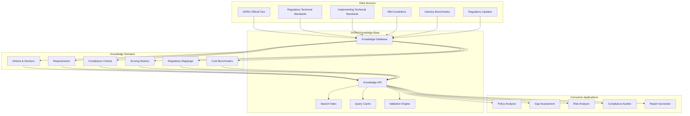

# DORA Requirements Database & Knowledge Base

The DORA Knowledge Base is a comprehensive, structured database containing all Digital Operational Resilience Act (DORA) requirements, compliance criteria, scoring rubrics, and regulatory mappings. This serves as the authoritative foundation for all DORA compliance assessment agents.

## Architecture Overview



## Core Features

### 1. Comprehensive DORA Coverage
- **Complete Regulatory Text**: All 81 articles of DORA with hierarchical structure
- **Technical Standards**: RTS and ITS with detailed implementation requirements  
- **EBA Guidelines**: Supporting guidance and clarifications
- **Cross-References**: Interconnected requirements and dependencies
- **Version Control**: Historical versions and amendment tracking

### 2. Structured Requirements Framework
- **Hierarchical Organization**: Chapters → Sections → Articles → Paragraphs → Requirements
- **Requirement Taxonomy**: Categorized by pillar, domain, and compliance type
- **Dependency Mapping**: Prerequisites and interdependent requirements
- **Scope Definitions**: Entity types, thresholds, and applicability criteria
- **Implementation Timelines**: Deadlines and phased requirements

### 3. Compliance Assessment Criteria
- **Scoring Rubrics**: 1-10 scale with detailed criteria for each level
- **Evidence Requirements**: Documentation and proof standards
- **Assessment Methods**: Automated checks vs manual review requirements
- **Risk Classifications**: Impact levels and residual risk assessments
- **Remediation Guidance**: Step-by-step improvement recommendations

### 4. Regulatory Intelligence
- **Cross-Regulation Mapping**: Connections to PCI-DSS, SOX, Basel III, etc.
- **Jurisdiction Variations**: Regional implementations and local requirements
- **Industry Standards**: ISO 27001, NIST, COBIT alignment
- **Update Notifications**: Real-time regulatory change monitoring
- **Impact Analysis**: Change impact on existing compliance programs

### 5. Cost and Benchmarking Data
- **Implementation Costs**: Resource requirements by requirement type
- **Industry Benchmarks**: Compliance maturity levels by sector
- **Timeline Estimates**: Typical implementation durations
- **Resource Allocation**: Personnel and technology requirements
- **ROI Metrics**: Compliance investment return calculations

## Data Structure

### DORA Articles Schema
```json
{
  "article_id": "art_1",
  "article_number": 1,
  "title": "Subject matter and scope",
  "chapter": {
    "id": "chapter_1",
    "title": "General provisions",
    "number": 1
  },
  "section": {
    "id": "section_1_1", 
    "title": "Subject matter, scope and definitions",
    "number": 1
  },
  "content": {
    "paragraphs": [
      {
        "id": "art_1_para_1",
        "number": 1,
        "text": "This Regulation lays down uniform requirements...",
        "requirements": ["req_1_1", "req_1_2"]
      }
    ]
  },
  "cross_references": ["art_2", "art_3"],
  "applicability": {
    "entity_types": ["credit_institution", "payment_institution"],
    "thresholds": {...},
    "exceptions": [...]
  },
  "effective_date": "2025-01-17",
  "implementation_deadline": "2025-01-17"
}
```

### Requirements Schema
```json
{
  "requirement_id": "req_1_1",
  "article_id": "art_1", 
  "title": "Digital operational resilience framework establishment",
  "description": "Financial entities shall maintain digital operational resilience...",
  "category": "governance",
  "pillar": "governance_arrangements",
  "requirement_type": "mandatory",
  "compliance_level": "level_2",
  "evidence_requirements": [
    {
      "type": "policy_document",
      "description": "Digital resilience policy approved by management body",
      "mandatory": true
    }
  ],
  "assessment_criteria": {
    "automated_checks": ["policy_exists", "approval_documented"],
    "manual_review": ["policy_completeness", "board_oversight"]
  },
  "scoring_rubric": {
    "1-2": "No policy or framework in place",
    "3-4": "Basic policy exists but lacks approval/implementation",
    "5-6": "Policy approved but limited implementation evidence",
    "7-8": "Well-implemented policy with some gaps",
    "9-10": "Comprehensive, fully-implemented framework"
  },
  "related_standards": {
    "iso_27001": ["A.5.1.1", "A.5.1.2"],
    "nist_csf": ["ID.GV-1", "ID.GV-2"],
    "cobit": ["APO01.01", "APO01.02"]
  },
  "implementation_guidance": "...",
  "common_gaps": ["Lack of board approval", "Missing incident procedures"],
  "remediation_steps": [...]
}
```

### Compliance Criteria Schema
```json
{
  "criteria_id": "crit_gov_001",
  "requirement_id": "req_1_1",
  "criterion": "Management body approval of digital resilience policy",
  "assessment_method": "document_review",
  "evidence_type": "board_resolution",
  "scoring_weights": {
    "policy_existence": 0.3,
    "board_approval": 0.4, 
    "implementation_evidence": 0.3
  },
  "maturity_levels": {
    "initial": "Ad-hoc approach, no formal policy",
    "managed": "Policy exists but limited governance",
    "defined": "Formal policy with board oversight",
    "quantitatively_managed": "Metrics-driven policy management",
    "optimizing": "Continuous improvement of resilience framework"
  },
  "automation_feasibility": "medium",
  "validation_rules": [
    "policy_document_exists",
    "board_approval_documented",
    "approval_date_within_validity"
  ]
}
```

### DORA Pillars Structure
```yaml
pillars:
  governance_arrangements:
    id: "pillar_1"
    title: "ICT risk management framework"
    description: "Governance arrangements and ICT risk management"
    chapters: [1, 2]
    articles: [1-16]
    key_requirements:
      - ict_risk_management_framework
      - management_body_responsibility
      - ict_risk_strategy
      - business_continuity_policy
    
  ict_related_incidents:
    id: "pillar_2" 
    title: "ICT-related incident management, classification and reporting"
    description: "Managing and reporting ICT incidents"
    chapters: [3]
    articles: [17-23]
    key_requirements:
      - incident_management_process
      - incident_classification
      - incident_reporting
      - lessons_learned_process
    
  digital_operational_resilience_testing:
    id: "pillar_3"
    title: "Digital operational resilience testing"
    description: "Testing framework and threat-led penetration testing"
    chapters: [4]
    articles: [24-27]
    key_requirements:
      - testing_program
      - threat_led_penetration_testing
      - testing_methodologies
      - remediation_plans
    
  ict_third_party_risk:
    id: "pillar_4"
    title: "Managing ICT third-party risk"
    description: "Third-party risk management and oversight"
    chapters: [5]
    articles: [28-44]
    key_requirements:
      - third_party_risk_strategy
      - due_diligence_procedures
      - contractual_arrangements
      - monitoring_oversight
    
  information_sharing:
    id: "pillar_5"
    title: "Information and intelligence sharing"
    description: "Cyber threat information sharing arrangements"
    chapters: [6]
    articles: [45-49]
    key_requirements:
      - information_sharing_arrangements
      - threat_intelligence
      - coordination_mechanisms
      - confidentiality_protections
```

## Entity Classifications

### Financial Entity Types
```yaml
entity_types:
  tier_1_entities:
    credit_institutions:
      threshold: "€5 billion total assets"
      enhanced_requirements: true
      testing_frequency: "annual"
      
    significant_payment_institutions:
      threshold: "€1 billion payment volume"
      enhanced_requirements: true
      
    electronic_money_institutions:
      threshold: "€1 billion e-money outstanding"
      enhanced_requirements: false
      
    investment_firms:
      threshold: "€5 billion assets under management"
      enhanced_requirements: true
      
    crypto_asset_service_providers:
      threshold: "€500 million crypto assets"
      enhanced_requirements: true
      
    central_securities_depositories:
      threshold: "all"
      enhanced_requirements: true
      
  tier_2_entities:
    smaller_institutions:
      threshold: "below tier 1 thresholds"
      enhanced_requirements: false
      testing_frequency: "triennial"
      simplified_requirements: true
      
    microfinance_institutions:
      threshold: "€5 million total assets" 
      enhanced_requirements: false
      
  exempt_entities:
    central_banks:
      exempt: true
      reason: "sovereign immunity"
      
    public_development_banks:
      exempt: true
      condition: "public mandate"
```

## Regulatory Timeline

### Implementation Phases
```yaml
implementation_timeline:
  phase_1_immediate:
    effective_date: "2025-01-17"
    requirements:
      - governance_framework_establishment
      - incident_reporting_procedures
      - basic_testing_program
    entities: "all"
    
  phase_2_enhanced:
    effective_date: "2025-07-17" 
    requirements:
      - threat_led_penetration_testing
      - enhanced_third_party_oversight
      - advanced_incident_classification
    entities: "tier_1_only"
    
  phase_3_optimization:
    effective_date: "2026-01-17"
    requirements:
      - continuous_monitoring
      - automated_reporting
      - cross_border_cooperation
    entities: "all"
```

## Assessment Scoring Framework

### Compliance Scoring (1-10 Scale)
```yaml
scoring_framework:
  score_1_2:
    level: "Non-compliant"
    description: "No evidence of requirement implementation"
    characteristics:
      - "No policies or procedures in place"
      - "No awareness of regulatory requirements"
      - "No implementation timeline"
    risk_level: "critical"
    
  score_3_4:
    level: "Minimal compliance"
    description: "Initial implementation with significant gaps"
    characteristics:
      - "Basic policies exist but lack detail"
      - "Limited implementation evidence"
      - "No regular review or updates"
    risk_level: "high"
    
  score_5_6:
    level: "Partial compliance"
    description: "Adequate implementation with notable gaps"
    characteristics:
      - "Policies approved and documented"
      - "Implementation in progress"
      - "Some monitoring and review processes"
    risk_level: "medium"
    
  score_7_8:
    level: "Good compliance"
    description: "Well-implemented with minor improvements needed"
    characteristics:
      - "Comprehensive policies and procedures"
      - "Evidence of effective implementation"
      - "Regular monitoring and review"
    risk_level: "low"
    
  score_9_10:
    level: "Excellent compliance"
    description: "Comprehensive implementation with continuous improvement"
    characteristics:
      - "Best-in-class policies and procedures"
      - "Full implementation with evidence"
      - "Continuous monitoring and optimization"
    risk_level: "minimal"
```

## Cross-Regulatory Mappings

### International Standards Alignment
```yaml
regulatory_mappings:
  iso_27001_2022:
    alignment_percentage: 85
    key_mappings:
      - dora_art_5: "A.5.1.1 - Information security policies"
      - dora_art_17: "A.16.1.1 - Incident management procedures"
      - dora_art_24: "A.14.2.8 - System security testing"
    
  nist_cybersecurity_framework:
    alignment_percentage: 90
    key_mappings:
      - dora_pillar_1: "IDENTIFY function"
      - dora_pillar_2: "RESPOND function"
      - dora_pillar_3: "DETECT function"
    
  basel_iii_operational_risk:
    alignment_percentage: 70
    key_mappings:
      - dora_governance: "Basel III Pillar 1 operational risk"
      - dora_testing: "Basel III stress testing requirements"
    
  pci_dss_v4:
    alignment_percentage: 60
    focus_areas:
      - payment_processing_security
      - incident_response_procedures
      - penetration_testing_requirements
```

## API Usage Examples

### Basic Requirements Query
```python
from dora_kb import DORAKnowledgeBase

# Initialize knowledge base
kb = DORAKnowledgeBase()

# Get all requirements for a specific article
article_requirements = kb.get_article_requirements("art_5")

# Search requirements by keyword
ict_requirements = kb.search_requirements("ICT risk management")

# Get compliance criteria for requirement
criteria = kb.get_compliance_criteria("req_5_1")
```

### Compliance Assessment
```python
# Assess policy document against DORA requirements
assessment = kb.assess_document(
    document_path="company_policy.pdf",
    assessment_scope=["pillar_1", "pillar_2"]
)

# Get scoring rubric for specific requirement
rubric = kb.get_scoring_rubric("req_17_1")

# Calculate compliance score
score = kb.calculate_compliance_score(
    requirement_id="req_5_1",
    evidence={
        "policy_exists": True,
        "board_approved": True,
        "implementation_evidence": 0.8
    }
)
```

### Benchmarking and Cost Estimation
```python
# Get industry benchmarks
benchmarks = kb.get_industry_benchmarks(
    entity_type="credit_institution",
    asset_size="5_50_billion"
)

# Estimate implementation costs
cost_estimate = kb.estimate_implementation_cost(
    requirements=["req_5_1", "req_17_1"],
    entity_profile={
        "type": "payment_institution",
        "size": "medium",
        "current_maturity": "level_2"
    }
)
```

## Performance Specifications

### Database Performance
- **Query Response Time**: < 100ms for requirement lookups
- **Search Performance**: < 500ms for full-text searches
- **Concurrent Users**: 1000+ simultaneous queries
- **Data Volume**: 50,000+ requirements with full provenance
- **Update Frequency**: Real-time regulatory change integration

### API Reliability
- **Availability**: 99.9% uptime SLA
- **Error Rate**: < 0.1% failed requests
- **Caching**: 95% cache hit rate for common queries
- **Scalability**: Horizontal scaling to 10x load
- **Backup**: Real-time replication with < 1 minute RPO

## Integration Points

### Consumer Applications
- **Policy Analyzer Agent**: Primary consumer for document assessment
- **Gap Assessment Agent**: Bulk requirements evaluation
- **Risk Analyzer Agent**: Risk-weighted compliance scoring
- **Compliance Auditor Agent**: Comprehensive audit trail generation
- **Reporting Engine**: Regulatory reporting template generation

### External Data Sources
- **EBA Updates**: Automated ingestion of regulatory changes
- **Industry Standards**: Regular synchronization with standards bodies
- **Legal Databases**: Cross-reference with legal interpretation resources
- **Cost Benchmarks**: Integration with industry cost survey data
- **Threat Intelligence**: Cyber threat landscape updates

## Getting Started

### Installation
```bash
cd dora-knowledge-base
pip install -r requirements.txt
python setup.py install
```

### Basic Setup
```python
from dora_kb import DORAKnowledgeBase

# Initialize with default configuration
kb = DORAKnowledgeBase()

# Load knowledge base data
kb.load_data()

# Verify installation
print(f"Loaded {kb.count_requirements()} requirements")
print(f"Covering {kb.count_articles()} DORA articles")
```

### Configuration
```yaml
# config/knowledge_base.yaml
database:
  host: "localhost"
  port: 5432
  database: "dora_kb"
  
search:
  engine: "elasticsearch"
  index: "dora_requirements"
  
caching:
  enabled: true
  backend: "redis"
  ttl: 3600
```

This knowledge base serves as the authoritative source for all DORA compliance assessments, providing the structured foundation needed for intelligent, automated compliance analysis. 