# DORA Compliance System - Database Architecture

This directory contains the database infrastructure configuration for the DORA Compliance System's multi-database architecture.

## Architecture Overview

The DORA compliance system employs a polyglot persistence approach with specialized databases for different data types and access patterns:

### Database Stack
1. **PostgreSQL** - Primary OLTP database for structured compliance data
2. **Neo4j** - Graph database for relationships and dependency mapping
3. **MongoDB** - Document database for flexible schemas and unstructured data
4. **InfluxDB** - Time-series database for metrics and monitoring data
5. **Redis** - In-memory cache and session store

### Data Distribution Strategy

```mermaid
graph TD
    A[DORA Compliance System] --> B[PostgreSQL<br/>Structured Data]
    A --> C[Neo4j<br/>Relationships]
    A --> D[MongoDB<br/>Documents]
    A --> E[InfluxDB<br/>Time-Series]
    A --> F[Redis<br/>Cache/Sessions]
    
    B --> B1[Policy Metadata]
    B --> B2[User Management]
    B --> B3[Organization Data]
    B --> B4[Compliance Reports]
    
    C --> C1[Policy Dependencies]
    C --> C2[System Architecture]
    C --> C3[Risk Relationships]
    C --> C4[Asset Mapping]
    
    D --> D1[Policy Documents]
    D --> D2[Analysis Results]
    D --> D3[Configuration Data]
    D --> D4[External Integrations]
    
    E --> E1[Performance Metrics]
    E --> E2[Agent Health Data]
    E --> E3[Audit Logs]
    E --> E4[System Events]
    
    F --> F1[Session Data]
    F --> F2[Cache Layer]
    F --> F3[Rate Limiting]
    F --> F4[Temporary Data]
```



## Directory Structure

```
databases/
├── README.md                           # This file
├── postgresql/                         # PostgreSQL configurations
│   ├── cluster/                       # PostgreSQL cluster setup
│   ├── schemas/                       # SQL schema definitions
│   ├── migrations/                    # Database migrations
│   ├── backup/                        # Backup configurations
│   └── monitoring/                    # Postgres monitoring
├── neo4j/                             # Neo4j graph database
│   ├── cluster/                       # Neo4j cluster setup
│   ├── schemas/                       # Graph schemas and constraints
│   ├── cypher/                        # Cypher queries and procedures
│   └── backup/                        # Neo4j backup strategies
├── mongodb/                           # MongoDB document database
│   ├── cluster/                       # MongoDB replica set
│   ├── schemas/                       # Document schemas
│   ├── indexes/                       # Index definitions
│   └── backup/                        # MongoDB backup
├── influxdb/                          # InfluxDB time-series
│   ├── cluster/                       # InfluxDB cluster
│   ├── schemas/                       # Measurement schemas
│   ├── retention/                     # Retention policies
│   └── backup/                        # InfluxDB backup
├── redis/                             # Redis cache
│   ├── cluster/                       # Redis cluster setup
│   ├── config/                        # Redis configurations
│   └── monitoring/                    # Redis monitoring
├── shared/                            # Shared configurations
│   ├── secrets/                       # Database secrets
│   ├── networking/                    # Network policies
│   ├── storage/                       # Storage configurations
│   └── monitoring/                    # Cross-database monitoring
└── scripts/                           # Database management scripts
    ├── setup-databases.sh            # Full setup automation
    ├── backup-all.sh                 # Comprehensive backup
    ├── restore-databases.sh          # Disaster recovery
    └── health-check.sh               # Health monitoring
```

## Database Roles and Responsibilities

### PostgreSQL - Primary OLTP Database
**Purpose**: Structured compliance data with ACID properties

**Data Types**:
- Organization profiles and metadata
- User accounts and authentication
- Policy metadata and classifications
- Compliance report summaries
- Audit trail references
- System configuration

**Key Features**:
- Full ACID compliance
- Complex queries and joins
- Referential integrity
- Mature backup/recovery
- Strong consistency

### Neo4j - Graph Database
**Purpose**: Relationship mapping and dependency analysis

**Data Types**:
- Policy dependencies and relationships
- System architecture mapping
- Risk propagation paths
- Asset interconnections
- Compliance framework relationships
- Third-party vendor networks

**Key Features**:
- Native graph processing
- Pattern matching (Cypher)
- Relationship traversal
- Graph algorithms
- Visual representation

### MongoDB - Document Database
**Purpose**: Flexible schema for complex documents

**Data Types**:
- Full policy documents (PDF/DOC content)
- Compliance analysis results
- Agent configuration data
- External system integrations
- Unstructured analysis outputs
- Flexible reporting data

**Key Features**:
- Schema flexibility
- Rich query language
- Horizontal scaling
- Document-oriented
- JSON/BSON storage

### InfluxDB - Time-Series Database
**Purpose**: High-volume time-stamped data

**Data Types**:
- System performance metrics
- Agent health and status data
- Compliance monitoring data
- Audit event streams
- Real-time dashboards
- Historical trend analysis

**Key Features**:
- Optimized for time-series
- High write throughput
- Data compression
- Retention policies
- Downsampling

### Redis - In-Memory Cache
**Purpose**: High-speed caching and session management

**Data Types**:
- User session data
- API response caching
- Rate limiting counters
- Temporary computation results
- Real-time notifications
- Distributed locks

**Key Features**:
- Sub-millisecond latency
- Atomic operations
- Pub/Sub messaging
- Data structures
- Persistence options

## High Availability Configuration

### PostgreSQL HA
- **Primary-Secondary Replication**: Streaming replication with hot standby
- **Connection Pooling**: PgBouncer for connection management
- **Backup Strategy**: Continuous WAL archiving + daily base backups
- **Failover**: Automatic failover with Patroni

### Neo4j HA
- **Causal Clustering**: Core and read replica servers
- **Load Balancing**: Driver-level load balancing
- **Backup Strategy**: Online backup with transaction log shipping
- **Consistency**: Causal consistency across cluster

### MongoDB HA
- **Replica Sets**: Primary-secondary-arbiter configuration
- **Sharding**: Horizontal partitioning for large datasets
- **Backup Strategy**: Mongodump + oplog tailing
- **Read Preferences**: Configurable read distribution

### InfluxDB HA
- **Clustering**: InfluxDB Enterprise clustering
- **Replication**: Cross-datacenter replication
- **Backup Strategy**: Snapshot backups + incremental
- **Retention**: Automatic data lifecycle management

### Redis HA
- **Redis Sentinel**: Master-slave with automatic failover
- **Clustering**: Redis Cluster for horizontal scaling
- **Backup Strategy**: RDB snapshots + AOF logs
- **Persistence**: Configurable durability levels

## Security Configuration

### Encryption
- **At Rest**: All databases encrypted with AES-256
- **In Transit**: TLS 1.3 for all connections
- **Key Management**: HashiCorp Vault integration
- **Certificate Management**: Automatic rotation

### Authentication & Authorization
- **PostgreSQL**: SCRAM-SHA-256 + role-based access
- **Neo4j**: Native auth + LDAP integration
- **MongoDB**: SCRAM-SHA-256 + X.509 certificates
- **InfluxDB**: JWT tokens + user/role management
- **Redis**: AUTH + ACL (Redis 6+)

### Network Security
- **Network Policies**: Kubernetes network isolation
- **VPC Security**: Private subnets for databases
- **Firewall Rules**: Restricted port access
- **Service Mesh**: Istio for service-to-service communication

## Performance Optimization

### Connection Management
- **Connection Pooling**: Application-level and database-level pooling
- **Connection Limits**: Configured per database and workload
- **Health Checks**: Automated connection validation
- **Circuit Breakers**: Fault tolerance patterns

### Query Optimization
- **Indexing Strategy**: Composite indexes for common queries
- **Query Analysis**: Regular EXPLAIN plan analysis
- **Caching**: Multi-level caching strategy
- **Materialized Views**: Pre-computed aggregations

### Resource Allocation
- **CPU/Memory**: Optimized for each database workload
- **Storage**: SSD storage with appropriate IOPS
- **Network**: Dedicated network bandwidth
- **Kubernetes**: Resource requests and limits

## Backup and Recovery Strategy

### Backup Types
1. **Full Backups**: Complete database snapshots
2. **Incremental Backups**: Changes since last backup
3. **Transaction Log Backups**: Point-in-time recovery
4. **Cross-Region Replication**: Disaster recovery

### Backup Schedule
- **Continuous**: Transaction log shipping
- **Hourly**: Incremental backups for critical data
- **Daily**: Full backups with compression
- **Weekly**: Long-term retention backups

### Recovery Procedures
- **Point-in-Time Recovery**: Restore to specific timestamp
- **Partial Recovery**: Restore specific databases/collections
- **Cross-Region Recovery**: Failover to secondary region
- **Testing**: Regular recovery drills

## Monitoring and Alerting

### Key Metrics
- **Performance**: Query response times, throughput
- **Availability**: Uptime, connection success rates
- **Resource Usage**: CPU, memory, disk, network
- **Replication**: Lag monitoring, sync status

### Alerting Rules
- **Critical**: Database unavailable, replication failure
- **Warning**: High resource usage, slow queries
- **Info**: Backup completion, maintenance events

### Dashboards
- **System Overview**: All databases health summary
- **Per-Database**: Detailed metrics per database type
- **Application**: Query patterns and performance
- **Capacity Planning**: Growth trends and forecasting

## Data Lifecycle Management

### Retention Policies
- **Audit Data**: 7 years (regulatory requirement)
- **Compliance Reports**: 5 years
- **Metrics Data**: 90 days (with downsampling)
- **Session Data**: 24 hours
- **Cache Data**: TTL-based expiration

### Archival Strategy
- **Cold Storage**: Move old data to object storage
- **Compression**: Archive with compression
- **Access Patterns**: Rare access optimization
- **Cost Optimization**: Storage class transitions

## Deployment Strategy

### Environment Progression
1. **Development**: Single-node deployments
2. **Staging**: Multi-node with reduced resources
3. **Production**: Full HA cluster deployment

### Blue-Green Deployments
- **Schema Changes**: Backward-compatible migrations
- **Data Migration**: Zero-downtime strategies
- **Rollback**: Quick rollback procedures
- **Testing**: Automated deployment validation

### Kubernetes Integration
- **Operators**: Database-specific Kubernetes operators
- **Storage**: Persistent volumes with proper classes
- **Networking**: Service mesh integration
- **Secrets**: Kubernetes secrets management

---

For database-specific implementation details, see the individual database directories and configuration files.

Last Updated: December 2024 