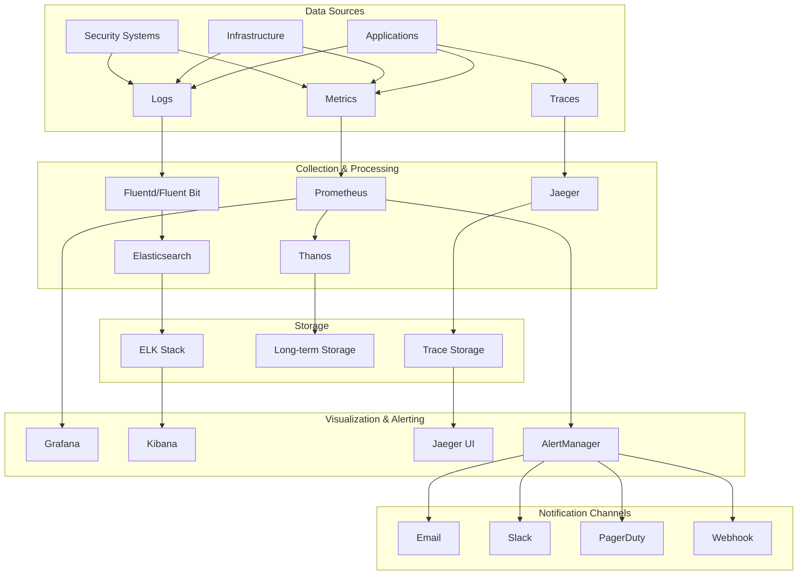
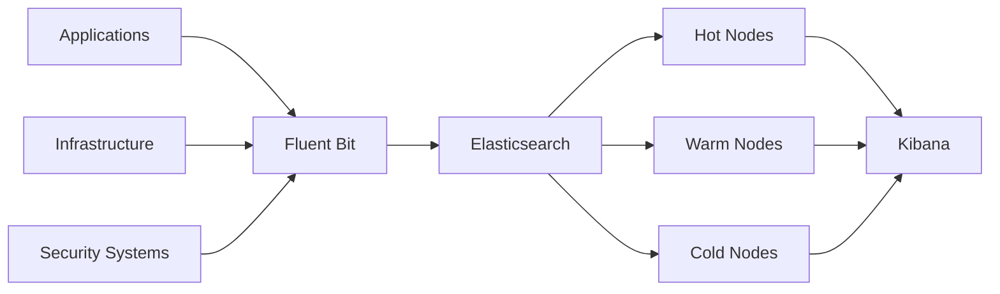

# DORA Compliance System - Monitoring & Observability Infrastructure

This directory contains the monitoring and observability infrastructure for the DORA Compliance System, implementing comprehensive monitoring, logging, tracing, and alerting capabilities.

## Observability Overview

The DORA compliance system implements a complete observability stack designed to provide deep insights into system performance, security, and compliance metrics:

### Three Pillars of Observability
1. **Metrics**: Quantitative measurements of system behavior
2. **Logs**: Detailed records of system events and transactions
3. **Traces**: End-to-end request flow through distributed services

### Key Objectives
- **Operational Excellence**: Proactive monitoring and alerting
- **Compliance Monitoring**: Real-time compliance status tracking
- **Performance Optimization**: Identify and resolve performance bottlenecks
- **Security Visibility**: Monitor security events and threats
- **Business Intelligence**: Generate insights from compliance data

## Monitoring Architecture

### High-Level Architecture


### Component Stack
- **Metrics Collection**: Prometheus with node-exporter, kube-state-metrics
- **Metrics Storage**: Thanos for long-term storage and global querying
- **Visualization**: Grafana with custom dashboards
- **Log Collection**: Fluent Bit for lightweight log forwarding
- **Log Storage**: Elasticsearch cluster with hot/warm/cold architecture
- **Log Analysis**: Kibana with custom compliance dashboards
- **Distributed Tracing**: Jaeger for end-to-end request tracing
- **Alerting**: AlertManager with multi-channel notifications
- **Uptime Monitoring**: Blackbox exporter for external services

## Directory Structure

```
monitoring/
├── README.md                           # This file
├── prometheus/                         # Prometheus configuration
│   ├── cluster/                       # Prometheus cluster setup
│   ├── rules/                         # Alerting and recording rules
│   ├── exporters/                     # Custom exporters
│   ├── servicemonitors/               # ServiceMonitor configurations
│   └── thanos/                        # Thanos configuration
├── grafana/                           # Grafana configuration
│   ├── cluster/                       # Grafana cluster setup
│   ├── dashboards/                    # Custom dashboards
│   ├── datasources/                   # Data source configurations
│   └── provisioning/                  # Automated provisioning
├── elasticsearch/                      # Elasticsearch cluster
│   ├── cluster/                       # ES cluster configuration
│   ├── indices/                       # Index templates
│   ├── policies/                      # Lifecycle policies
│   └── security/                      # ES security configuration
├── kibana/                            # Kibana configuration
│   ├── cluster/                       # Kibana setup
│   ├── dashboards/                    # Log analysis dashboards
│   ├── visualizations/                # Custom visualizations
│   └── saved-searches/                # Compliance searches
├── jaeger/                            # Distributed tracing
│   ├── cluster/                       # Jaeger cluster setup
│   ├── collectors/                    # Trace collectors
│   └── sampling/                      # Sampling strategies
├── fluent-bit/                        # Log collection
│   ├── daemonset/                     # Fluent Bit DaemonSet
│   ├── config/                        # Collection configurations
│   └── parsers/                       # Log parsers
├── alertmanager/                      # Alert management
│   ├── cluster/                       # AlertManager cluster
│   ├── config/                        # Alerting configurations
│   ├── templates/                     # Notification templates
│   └── receivers/                     # Notification channels
├── exporters/                         # Custom exporters
│   ├── blackbox/                      # Uptime monitoring
│   ├── compliance/                    # Compliance metrics
│   └── security/                      # Security metrics
├── dashboards/                        # Shared dashboards
│   ├── infrastructure/                # Infrastructure monitoring
│   ├── applications/                  # Application monitoring
│   ├── security/                      # Security monitoring
│   ├── compliance/                    # Compliance monitoring
│   └── business/                      # Business metrics
└── scripts/                           # Automation scripts
    ├── setup-monitoring.sh           # Complete monitoring setup
    ├── backup-config.sh              # Configuration backup
    ├── restore-config.sh             # Configuration restore
    └── health-check.sh               # Monitoring health check
```

## Metrics Collection Strategy

### Prometheus Configuration
- **Scrape Intervals**: 15s for critical metrics, 30s for standard metrics
- **Retention**: 15 days local storage, long-term via Thanos
- **High Availability**: 3 Prometheus replicas with deduplication
- **Federation**: Hierarchical federation for multi-cluster environments

### Key Metrics Categories
```yaml
# Infrastructure Metrics
- node_cpu_seconds_total
- node_memory_MemAvailable_bytes
- node_filesystem_avail_bytes
- kube_pod_status_phase
- kube_deployment_status_replicas

# Application Metrics
- http_requests_total
- http_request_duration_seconds
- database_connections_active
- queue_messages_total
- cache_hit_ratio

# Security Metrics
- auth_attempts_total
- failed_logins_total
- security_violations_total
- certificate_expiry_seconds
- vault_audit_events_total

# Compliance Metrics
- compliance_assessments_total
- policy_violations_total
- audit_events_total
- sla_compliance_ratio
- incident_response_time_seconds

# Business Metrics
- active_users_total
- reports_generated_total
- risk_assessments_completed
- compliance_score_percentage
- time_to_compliance_days
```

## Logging Strategy

### Log Collection Architecture


### Log Categories and Retention
```yaml
# Application Logs
audit_logs:
  retention: 7_years  # Regulatory requirement
  index_pattern: "audit-logs-*"
  
application_logs:
  retention: 90_days
  index_pattern: "app-logs-*"
  
security_logs:
  retention: 3_years
  index_pattern: "security-logs-*"
  
infrastructure_logs:
  retention: 30_days
  index_pattern: "infra-logs-*"
  
debug_logs:
  retention: 7_days
  index_pattern: "debug-logs-*"
```

### Log Format Standardization
```json
{
  "timestamp": "2024-01-01T12:00:00.000Z",
  "level": "INFO",
  "service": "compliance-engine",
  "component": "policy-analyzer",
  "correlation_id": "uuid-4",
  "user_id": "user123",
  "session_id": "session456",
  "action": "policy_analysis",
  "resource": "policy/dora/123",
  "outcome": "success",
  "duration_ms": 150,
  "ip_address": "10.0.1.100",
  "user_agent": "dora-client/1.0",
  "message": "Policy analysis completed successfully",
  "metadata": {
    "policy_id": "dora-policy-123",
    "assessment_id": "assessment-456"
  }
}
```

## Distributed Tracing

### Jaeger Configuration
- **Sampling Strategy**: Probabilistic (1% for normal, 100% for errors)
- **Storage**: Elasticsearch backend for scalability
- **Retention**: 7 days for detailed traces, 30 days for summaries
- **Dependencies**: Automatic service dependency mapping

### Trace Instrumentation
```yaml
# Service Dependencies
api_gateway:
  traces_to: [auth_service, compliance_service]
  
compliance_service:
  traces_to: [database, message_queue, vault]
  
ai_agents:
  traces_to: [model_service, data_service]
  
policy_analyzer:
  traces_to: [database, external_apis]
```

## Alerting Framework

### Alert Severity Levels
```yaml
Critical:
  description: "System down or major functionality impaired"
  response_time: "< 5 minutes"
  escalation: "Immediate PagerDuty + Phone"
  
Warning:
  description: "Performance degradation or minor issues"
  response_time: "< 30 minutes"
  escalation: "Slack + Email"
  
Info:
  description: "Informational alerts and notifications"
  response_time: "Next business day"
  escalation: "Email only"
```

### Key Alert Rules
```yaml
# Infrastructure Alerts
- alert: HighCPUUsage
  expr: node_cpu_usage > 80
  for: 5m
  severity: warning

- alert: HighMemoryUsage
  expr: node_memory_usage > 85
  for: 5m
  severity: warning

- alert: DiskSpaceUsage
  expr: node_disk_usage > 90
  for: 1m
  severity: critical

# Application Alerts
- alert: HighErrorRate
  expr: rate(http_requests_total{status=~"5.."}[5m]) > 0.05
  for: 2m
  severity: critical

- alert: HighLatency
  expr: histogram_quantile(0.95, rate(http_request_duration_seconds_bucket[5m])) > 1
  for: 5m
  severity: warning

# Security Alerts
- alert: FailedLoginAttempts
  expr: rate(auth_failures_total[5m]) > 5
  for: 1m
  severity: warning

- alert: SecurityViolation
  expr: increase(security_violations_total[5m]) > 0
  for: 0s
  severity: critical

# Compliance Alerts
- alert: ComplianceScoreDropped
  expr: compliance_score < 80
  for: 5m
  severity: warning

- alert: AuditLogDeliveryFailure
  expr: rate(audit_log_failures_total[5m]) > 0
  for: 1m
  severity: critical
```

## Dashboard Strategy

### Grafana Dashboard Categories

#### 1. Executive Overview
- System health summary
- Compliance score trends
- Business KPIs
- SLA performance
- Incident summary

#### 2. Infrastructure Monitoring
- Kubernetes cluster health
- Node resource utilization
- Pod status and restarts
- Network traffic patterns
- Storage utilization

#### 3. Application Performance
- Request rates and latency
- Error rates and types
- Database performance
- Queue depths and processing
- Cache hit rates

#### 4. Security Monitoring
- Authentication metrics
- Failed login attempts
- Security violations
- Certificate expiry
- Vault audit events

#### 5. Compliance Monitoring
- Assessment progress
- Policy violations
- Audit event rates
- Compliance scores
- Remediation tracking

#### 6. Business Intelligence
- User activity patterns
- Report generation metrics
- Risk assessment trends
- Regulatory deadlines
- Cost optimization

## Performance and Scalability

### Resource Planning
```yaml
# Prometheus
cpu: 4 cores
memory: 8GB
storage: 1TB SSD
retention: 15 days

# Thanos
cpu: 2 cores
memory: 4GB
storage: 10TB object storage

# Elasticsearch
hot_nodes: 3 nodes, 8 cores, 32GB RAM, 2TB NVMe
warm_nodes: 3 nodes, 4 cores, 16GB RAM, 4TB SSD
cold_nodes: 3 nodes, 2 cores, 8GB RAM, 8TB HDD

# Grafana
cpu: 2 cores
memory: 4GB
storage: 100GB

# Jaeger
cpu: 2 cores
memory: 4GB
storage: 500GB
```

### Scaling Strategies
- **Horizontal Scaling**: Multiple Prometheus instances with sharding
- **Vertical Scaling**: Increased resources for Elasticsearch hot nodes
- **Data Lifecycle**: Automated hot/warm/cold transitions
- **Query Optimization**: Efficient PromQL and KQL queries
- **Caching**: Dashboard result caching in Grafana

## Security and Compliance

### Data Protection
- **Encryption**: TLS 1.3 for all communications
- **Authentication**: OAuth 2.0/OIDC integration
- **Authorization**: RBAC with fine-grained permissions
- **Audit Logging**: Complete access and configuration logs
- **Data Retention**: Compliance with regulatory requirements

### Access Control
```yaml
# Grafana Roles
Admin:
  - Full dashboard and data source management
  - User management
  - System configuration

Editor:
  - Dashboard creation and editing
  - Query execution
  - Annotation management

Viewer:
  - Dashboard viewing only
  - No configuration access

# Kibana Roles
Compliance_Analyst:
  - Access to compliance and audit indices
  - Dashboard creation
  - Report generation

Security_Analyst:
  - Access to security indices
  - Incident investigation
  - Threat analysis

Developer:
  - Access to application logs
  - Performance analysis
  - Debug capabilities
```

## Backup and Disaster Recovery

### Backup Strategy
- **Configuration Backups**: Daily backup of all configurations
- **Dashboard Backups**: Automated Grafana dashboard exports
- **Index Snapshots**: Daily Elasticsearch snapshots
- **Cross-Region Replication**: Critical data replicated to secondary region

### Recovery Procedures
- **RTO**: < 1 hour for monitoring restoration
- **RPO**: < 15 minutes for metrics data
- **Testing**: Monthly disaster recovery drills
- **Documentation**: Detailed runbooks for all scenarios

## Integration Points

### External Systems
- **SIEM Integration**: Forward security events to external SIEM
- **Ticketing**: Automatic ticket creation for critical alerts
- **Cloud Monitoring**: Integration with AWS CloudWatch
- **Business Intelligence**: Data export to BI tools

### API Endpoints
```yaml
# Prometheus
metrics_api: "https://prometheus.dora-monitoring.svc:9090/api/v1"

# Grafana
dashboards_api: "https://grafana.dora-monitoring.svc:3000/api"

# Elasticsearch
search_api: "https://elasticsearch.dora-monitoring.svc:9200"

# Jaeger
traces_api: "https://jaeger.dora-monitoring.svc:16686/api"
```

## Cost Optimization

### Storage Optimization
- **Data Compression**: Elasticsearch compression enabled
- **Index Lifecycle**: Automated data transitions
- **Query Caching**: Reduced computation overhead
- **Resource Right-sizing**: Regular resource utilization review

### Monitoring Efficiency
- **Metric Cardinality**: Control high-cardinality metrics
- **Sampling**: Appropriate trace sampling rates
- **Retention Policies**: Optimal data retention periods
- **Query Optimization**: Efficient dashboard queries

---

This monitoring infrastructure provides comprehensive observability for the DORA compliance system while maintaining performance, security, and cost efficiency.

Last Updated: December 2024 