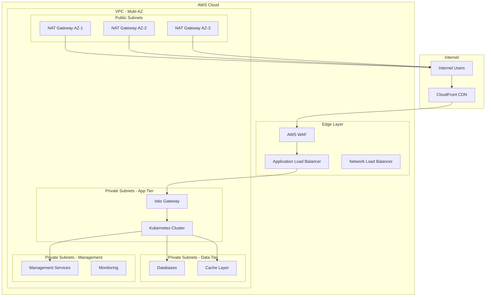
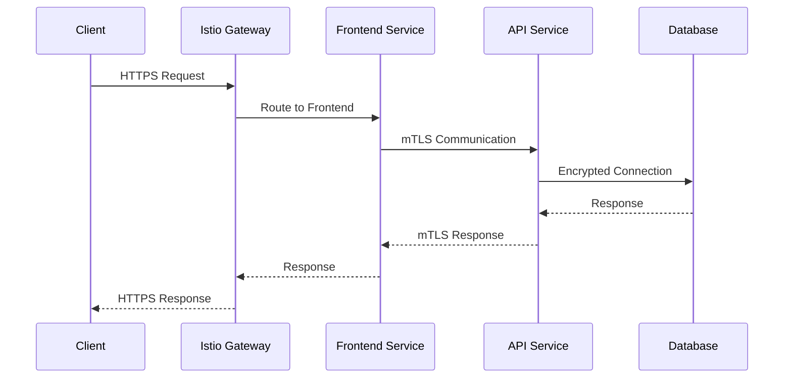

# DORA Compliance System - Network Infrastructure

This directory contains the network infrastructure configuration for the DORA Compliance System, implementing secure, scalable, and resilient networking capabilities.

## Network Architecture Overview

The DORA compliance system implements a comprehensive network architecture designed for security, performance, and regulatory compliance:

### Core Principles
- **Zero-Trust Networking**: Every connection is verified and encrypted
- **Defense in Depth**: Multiple layers of network security
- **High Availability**: Redundant paths and failover mechanisms
- **Performance Optimization**: CDN, load balancing, and traffic shaping
- **Compliance Ready**: Audit logging and monitoring for all network traffic

### Network Topology


## Directory Structure

```
network/
├── README.md                          # This file
├── vpc/                               # VPC configuration
│   ├── main.tf                       # VPC Terraform configuration
│   ├── subnets.tf                    # Subnet configurations
│   ├── routing.tf                    # Route table configurations
│   ├── nat-gateways.tf               # NAT Gateway setup
│   └── security-groups.tf            # Security group definitions
├── service-mesh/                      # Service mesh configuration
│   ├── istio/                        # Istio configuration
│   │   ├── installation/             # Istio installation
│   │   ├── gateways/                 # Gateway configurations
│   │   ├── virtual-services/         # Virtual service definitions
│   │   ├── destination-rules/        # Destination rule configurations
│   │   └── policies/                 # Security policies
│   └── envoy/                        # Envoy proxy configurations
├── ingress/                          # Ingress controllers
│   ├── nginx/                        # NGINX Ingress Controller
│   ├── traefik/                      # Traefik configuration
│   └── aws-load-balancer/            # AWS Load Balancer Controller
├── load-balancers/                   # Load balancer configurations
│   ├── application/                  # Application Load Balancers
│   ├── network/                      # Network Load Balancers
│   └── target-groups/                # Target group definitions
├── dns/                              # DNS configuration
│   ├── route53/                      # Route 53 configurations
│   ├── external-dns/                 # External DNS controller
│   └── certificates/                 # SSL/TLS certificates
├── cdn/                              # CDN configuration
│   ├── cloudfront/                   # CloudFront distributions
│   ├── caching-policies/             # Cache configurations
│   └── origins/                      # Origin configurations
├── security/                         # Network security
│   ├── waf/                          # Web Application Firewall
│   ├── ddos-protection/              # DDoS protection
│   ├── network-policies/             # Kubernetes network policies
│   └── firewall-rules/               # Security group rules
├── monitoring/                       # Network monitoring
│   ├── vpc-flow-logs/                # VPC Flow Logs
│   ├── cloudwatch/                   # CloudWatch configurations
│   └── network-insights/             # Network insights
└── scripts/                          # Automation scripts
    ├── setup-network.sh              # Complete network setup
    ├── deploy-istio.sh                # Service mesh deployment
    ├── configure-ingress.sh           # Ingress configuration
    └── network-diagnostics.sh         # Network troubleshooting
```

## VPC Architecture

### Multi-AZ Design
- **3 Availability Zones**: Distributed across us-west-2a, us-west-2b, us-west-2c
- **CIDR Block**: 10.0.0.0/16 (65,536 IP addresses)
- **Subnet Strategy**: Public, Private, and Database subnets in each AZ

### Subnet Configuration
```yaml
# Public Subnets (Internet Gateway attached)
public_subnet_az1: 10.0.1.0/24   # 254 IPs - NAT Gateway, Load Balancers
public_subnet_az2: 10.0.2.0/24   # 254 IPs - NAT Gateway, Load Balancers  
public_subnet_az3: 10.0.3.0/24   # 254 IPs - NAT Gateway, Load Balancers

# Private Subnets - Application Tier
private_app_az1: 10.0.10.0/24    # 254 IPs - Kubernetes nodes
private_app_az2: 10.0.11.0/24    # 254 IPs - Kubernetes nodes
private_app_az3: 10.0.12.0/24    # 254 IPs - Kubernetes nodes

# Private Subnets - Data Tier
private_data_az1: 10.0.20.0/24   # 254 IPs - Databases, Cache
private_data_az2: 10.0.21.0/24   # 254 IPs - Databases, Cache
private_data_az3: 10.0.22.0/24   # 254 IPs - Databases, Cache

# Private Subnets - Management
private_mgmt_az1: 10.0.30.0/24   # 254 IPs - Monitoring, Logging
private_mgmt_az2: 10.0.31.0/24   # 254 IPs - Monitoring, Logging
private_mgmt_az3: 10.0.32.0/24   # 254 IPs - Monitoring, Logging
```

### Security Groups
```yaml
# Application Load Balancer Security Group
alb_security_group:
  ingress:
    - port: 443 (HTTPS)
      source: 0.0.0.0/0
    - port: 80 (HTTP - redirect to HTTPS)
      source: 0.0.0.0/0
  egress:
    - all traffic to private subnets

# Kubernetes Nodes Security Group
k8s_nodes_security_group:
  ingress:
    - port: 443
      source: alb_security_group
    - port: 30000-32767 (NodePort range)
      source: alb_security_group
    - all traffic from same security group
  egress:
    - all traffic

# Database Security Group
database_security_group:
  ingress:
    - port: 5432 (PostgreSQL)
      source: k8s_nodes_security_group
    - port: 6379 (Redis)
      source: k8s_nodes_security_group
    - port: 9200 (Elasticsearch)
      source: k8s_nodes_security_group
  egress:
    - HTTPS to internet (for updates)
```

## Service Mesh Architecture (Istio)

### Istio Components
- **Istiod**: Control plane for traffic management, security, and observability
- **Envoy Sidecars**: Data plane proxies for all service communication
- **Gateways**: Edge proxy for external traffic ingress
- **Virtual Services**: Traffic routing and load balancing rules
- **Destination Rules**: Service-level policies and circuit breakers

### Traffic Flow


### Security Features
- **mTLS**: Automatic mutual TLS for all service-to-service communication
- **Authorization Policies**: Fine-grained access control between services
- **Security Policies**: Rate limiting, authentication, and authorization
- **Traffic Encryption**: All traffic encrypted in transit

## Load Balancing Strategy

### Application Load Balancer (ALB)
- **Layer 7**: HTTP/HTTPS load balancing with path-based routing
- **SSL Termination**: SSL/TLS certificates managed by ACM
- **WAF Integration**: AWS WAF for application-layer protection
- **Health Checks**: Advanced health checking with custom paths

### Network Load Balancer (NLB)
- **Layer 4**: TCP/UDP load balancing for high performance
- **Static IPs**: Fixed IP addresses for firewall whitelisting
- **High Throughput**: Millions of requests per second capability
- **Cross-Zone**: Load balancing across all availability zones

### Target Groups
```yaml
# Frontend Application Target Group
frontend_target_group:
  protocol: HTTP
  port: 80
  health_check:
    path: /health
    interval: 30s
    timeout: 5s
    healthy_threshold: 2
    unhealthy_threshold: 3

# API Services Target Group
api_target_group:
  protocol: HTTP
  port: 8080
  health_check:
    path: /api/health
    interval: 15s
    timeout: 3s
    healthy_threshold: 2
    unhealthy_threshold: 2

# Monitoring Target Group
monitoring_target_group:
  protocol: HTTP
  port: 3000
  health_check:
    path: /api/health
    interval: 30s
    timeout: 5s
    healthy_threshold: 2
    unhealthy_threshold: 3
```

## DNS and Certificate Management

### Route 53 Configuration
- **Hosted Zone**: dora-compliance.com
- **Subdomains**: 
  - api.dora-compliance.com (API services)
  - app.dora-compliance.com (Frontend application)
  - monitoring.dora-compliance.com (Grafana, Kibana)
  - admin.dora-compliance.com (Administrative interfaces)

### SSL/TLS Certificates
- **ACM Certificates**: AWS Certificate Manager for load balancer termination
- **Let's Encrypt**: Automated certificate renewal for Kubernetes ingress
- **Certificate Rotation**: Automatic rotation with zero downtime
- **TLS 1.3**: Latest TLS version for maximum security

### External DNS Integration
```yaml
external_dns_config:
  provider: aws
  aws:
    zone_type: public
    zone_id_filters:
      - dora-compliance.com
  policy: sync
  registry: txt
  txt_owner_id: dora-k8s-cluster
```

## CDN Configuration (CloudFront)

### Distribution Setup
- **Global Edge Locations**: 200+ edge locations worldwide
- **Origin Protection**: Origin Access Control (OAC) for S3
- **Custom Behaviors**: Different caching rules per path pattern
- **Real-time Monitoring**: CloudWatch metrics and logging

### Caching Strategy
```yaml
# Static Assets Caching
static_assets:
  path_pattern: "/static/*"
  ttl_min: 86400      # 1 day
  ttl_default: 2592000 # 30 days
  ttl_max: 31536000   # 1 year
  compress: true

# API Responses Caching
api_responses:
  path_pattern: "/api/*"
  ttl_min: 0
  ttl_default: 0
  ttl_max: 0
  compress: false
  forward_headers:
    - Authorization
    - Content-Type

# Dynamic Content
dynamic_content:
  path_pattern: "/app/*"
  ttl_min: 0
  ttl_default: 3600   # 1 hour
  ttl_max: 86400      # 1 day
  compress: true
```

## Network Security

### Web Application Firewall (WAF)
- **Managed Rules**: AWS Managed Rules for common vulnerabilities
- **Custom Rules**: DORA-specific security rules
- **Rate Limiting**: Protection against DDoS and abuse
- **Geo-blocking**: Country-based access restrictions
- **IP Whitelisting**: Allow/deny lists for specific IP ranges

### DDoS Protection
- **AWS Shield Standard**: Automatic DDoS protection
- **AWS Shield Advanced**: Enhanced DDoS protection and response
- **CloudFront**: Distributed traffic absorption
- **Rate Limiting**: Application-level rate limiting

### Network Monitoring
```yaml
# VPC Flow Logs
flow_logs:
  destination: CloudWatch Logs
  traffic_type: ALL
  format: custom
  fields:
    - srcaddr
    - dstaddr
    - srcport
    - dstport
    - protocol
    - packets
    - bytes
    - start
    - end
    - action

# Network Insights
network_insights:
  path_analysis: enabled
  reachability_analysis: enabled
  performance_monitoring: enabled
```

## Performance Optimization

### Traffic Shaping
- **Quality of Service**: Prioritization of critical traffic
- **Bandwidth Management**: Allocation per service type
- **Latency Optimization**: Edge caching and geographic routing
- **Connection Pooling**: Efficient connection reuse

### Global Acceleration
- **AWS Global Accelerator**: Improved global performance
- **Anycast IPs**: Route traffic to nearest endpoint
- **Health Checks**: Automatic failover to healthy endpoints
- **Traffic Dials**: Gradual traffic shifting for deployments

## Compliance and Audit

### Network Logging
- **VPC Flow Logs**: Complete network traffic logging
- **ALB Access Logs**: Detailed request logging
- **CloudFront Logs**: Edge request and performance logs
- **WAF Logs**: Security event logging

### Compliance Features
- **Data Sovereignty**: Regional data residency controls
- **Encryption**: All traffic encrypted in transit
- **Access Logging**: Complete audit trail
- **Network Isolation**: Microsegmentation with security groups

## Disaster Recovery

### Multi-Region Setup
- **Primary Region**: us-west-2 (Oregon)
- **Secondary Region**: us-east-1 (Virginia)
- **Cross-Region Replication**: Database and storage replication
- **DNS Failover**: Automatic Route 53 health check failover

### High Availability
- **AZ Distribution**: Resources spread across 3+ AZs
- **Auto Scaling**: Automatic capacity adjustment
- **Health Monitoring**: Continuous health checks
- **Automated Recovery**: Self-healing infrastructure

## Cost Optimization

### Traffic Optimization
- **CDN Offloading**: Reduce origin traffic costs
- **Compression**: Reduce bandwidth usage
- **Edge Caching**: Minimize compute resource usage
- **Reserved Capacity**: Committed use discounts

### Resource Right-sizing
- **Load Balancer Optimization**: Appropriate LB types
- **NAT Gateway Efficiency**: Minimize cross-AZ traffic
- **Data Transfer Optimization**: Regional data locality

## Integration Points

### Kubernetes Integration
- **AWS Load Balancer Controller**: Automatic ALB/NLB provisioning
- **External DNS**: Automatic DNS record management
- **Cert Manager**: Automatic certificate provisioning
- **Cluster Autoscaler**: Dynamic node scaling

### Monitoring Integration
- **CloudWatch**: Native AWS monitoring
- **Prometheus**: Kubernetes-native monitoring
- **Istio Telemetry**: Service mesh observability
- **Custom Metrics**: Business and compliance metrics

---

This network infrastructure provides enterprise-grade networking for the DORA compliance system with security, performance, and regulatory compliance as core design principles.

Last Updated: December 2024 