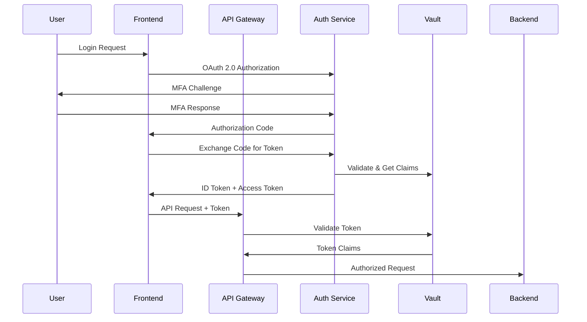
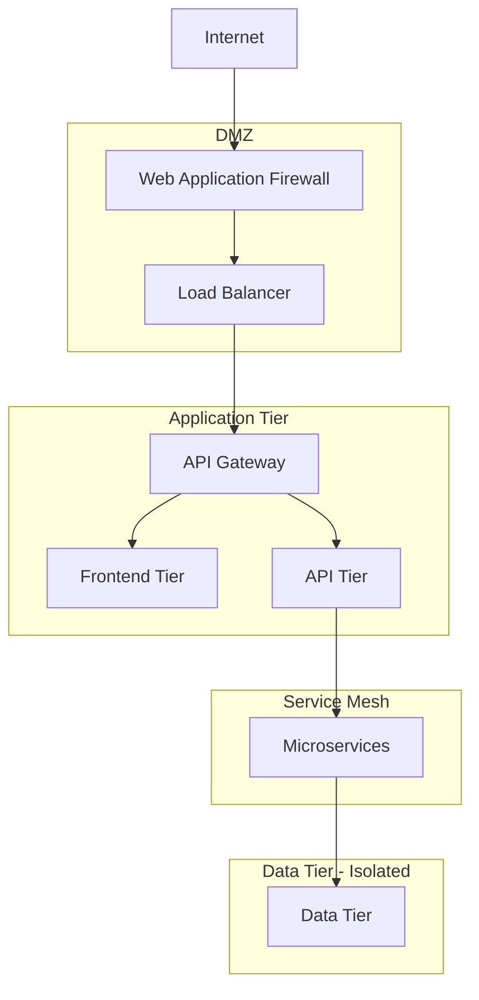

# DORA Compliance System - Security Framework

This directory contains the security infrastructure and policies for the DORA Compliance System, implementing a comprehensive zero-trust security model.

## Security Architecture Overview

The DORA compliance system implements a multi-layered security framework designed to meet regulatory requirements and protect sensitive financial data:

### Zero-Trust Security Model
- **Never Trust, Always Verify**: Every request is authenticated and authorized
- **Least Privilege Access**: Minimal access rights for users and services
- **Assume Breach**: Defense in depth with multiple security layers
- **Continuous Verification**: Real-time monitoring and adaptive controls

### Security Principles
1. **Defense in Depth**: Multiple overlapping security controls
2. **Security by Design**: Security built into every component
3. **Compliance First**: Regulatory requirements drive security design
4. **Automation**: Automated security controls and response
5. **Visibility**: Comprehensive logging and monitoring

## Security Components

### 1. Identity and Access Management (IAM)
- **Authentication**: OAuth 2.0/OIDC with multi-factor authentication
- **Authorization**: Role-Based Access Control (RBAC) with fine-grained permissions
- **Identity Providers**: Integration with enterprise SSO systems
- **Service Identity**: Workload identity for service-to-service authentication

### 2. Secrets Management
- **HashiCorp Vault**: Centralized secrets storage and management
- **Dynamic Secrets**: Short-lived, automatically rotated credentials
- **Secret Injection**: Secure delivery of secrets to applications
- **Audit Trail**: Complete audit log of secret access

### 3. Network Security
- **Zero-Trust Network**: Micro-segmentation with network policies
- **Service Mesh**: Istio for encrypted service-to-service communication
- **Ingress Security**: WAF and DDoS protection at the edge
- **Private Networks**: Isolated VPC with private subnets

### 4. Data Protection
- **Encryption at Rest**: AES-256 encryption for all stored data
- **Encryption in Transit**: TLS 1.3 for all network communications
- **Key Management**: Automated key rotation and lifecycle management
- **Data Classification**: Automatic classification and protection

### 5. Security Monitoring
- **SIEM Integration**: Security Information and Event Management
- **Behavioral Analytics**: AI-powered anomaly detection
- **Threat Intelligence**: Real-time threat feed integration
- **Incident Response**: Automated response to security events

## Directory Structure

```
security/
├── README.md                           # This file
├── vault/                              # HashiCorp Vault configuration
│   ├── cluster/                       # Vault cluster setup
│   ├── policies/                      # Vault policies
│   ├── auth-methods/                  # Authentication methods
│   ├── secrets-engines/               # Secret engines configuration
│   └── scripts/                       # Vault management scripts
├── rbac/                              # Role-Based Access Control
│   ├── policies/                      # RBAC policies
│   ├── roles/                         # Role definitions
│   ├── bindings/                      # Role bindings
│   └── service-accounts/              # Service account configurations
├── network-policies/                   # Kubernetes network policies
│   ├── default-deny/                  # Default deny policies
│   ├── namespace-isolation/           # Namespace isolation
│   ├── ingress-rules/                 # Ingress traffic rules
│   └── egress-rules/                  # Egress traffic rules
├── certificates/                       # Certificate management
│   ├── ca/                            # Certificate Authority setup
│   ├── tls/                           # TLS certificate configurations
│   ├── mtls/                          # mTLS configurations
│   └── cert-manager/                  # cert-manager setup
├── encryption/                         # Data encryption configurations
│   ├── at-rest/                       # Encryption at rest
│   ├── in-transit/                    # Encryption in transit
│   ├── key-management/                # Key management
│   └── policies/                      # Encryption policies
├── monitoring/                         # Security monitoring
│   ├── falco/                         # Runtime security monitoring
│   ├── opa/                           # Open Policy Agent
│   ├── security-metrics/              # Security metrics collection
│   └── alerts/                        # Security alerting rules
├── compliance/                         # Compliance frameworks
│   ├── dora/                          # DORA-specific requirements
│   ├── gdpr/                          # GDPR compliance
│   ├── audit/                         # Audit configurations
│   └── reports/                       # Compliance reporting
└── scripts/                           # Security automation scripts
    ├── setup-security.sh             # Complete security setup
    ├── vault-init.sh                 # Vault initialization
    ├── cert-rotation.sh              # Certificate rotation
    └── security-scan.sh              # Security scanning
```

## Authentication Architecture

### OAuth 2.0/OIDC Flow


### Multi-Factor Authentication
- **Primary Factor**: Username/password or certificate
- **Secondary Factor**: TOTP, SMS, or hardware token
- **Risk-Based**: Adaptive MFA based on risk assessment
- **Backup Codes**: Recovery codes for emergency access

## Authorization Model

### Role-Based Access Control (RBAC)
```yaml
# Role Hierarchy
SuperAdmin:
  - Full system access
  - User management
  - System configuration

ComplianceManager:
  - Compliance data access
  - Report generation
  - Policy management

Auditor:
  - Read-only access to audit data
  - Report viewing
  - Evidence review

Analyst:
  - Data analysis access
  - Dashboard viewing
  - Limited reporting

Viewer:
  - Read-only access
  - Basic reporting
```

### Attribute-Based Access Control (ABAC)
- **Subject Attributes**: User role, department, clearance level
- **Resource Attributes**: Data classification, sensitivity level
- **Environment Attributes**: Time, location, device trust
- **Action Attributes**: Read, write, delete, export

## Network Security Architecture

### Zero-Trust Network Segmentation


### Network Policies
- **Default Deny**: Block all traffic by default
- **Namespace Isolation**: Strict isolation between namespaces
- **Service-to-Service**: Explicit allow rules for required communication
- **Ingress/Egress**: Controlled external connectivity

## Data Protection Strategy

### Encryption Standards
- **AES-256-GCM**: Data at rest encryption
- **TLS 1.3**: Data in transit encryption
- **X25519**: Key exchange algorithm
- **ECDSA P-384**: Digital signatures

### Key Management Lifecycle
1. **Generation**: Hardware Security Module (HSM) generation
2. **Distribution**: Secure key delivery via Vault
3. **Rotation**: Automatic key rotation policies
4. **Revocation**: Immediate key revocation capability
5. **Archival**: Secure key archival for compliance

### Data Classification
- **Public**: No restrictions (marketing materials)
- **Internal**: Company confidential (policies, procedures)
- **Confidential**: Sensitive business data (compliance reports)
- **Restricted**: Highly sensitive (customer PII, financial data)

## Secrets Management with HashiCorp Vault

### Vault Architecture
- **High Availability**: Multi-node cluster with auto-unsealing
- **Dynamic Secrets**: Database credentials, API keys
- **PKI Engine**: Certificate authority for mTLS
- **Transit Engine**: Encryption-as-a-Service
- **Audit Logging**: Complete audit trail

### Secret Engines
- **KV v2**: Static secrets with versioning
- **Database**: Dynamic database credentials
- **PKI**: Certificate generation and management
- **Transit**: Data encryption and decryption
- **AWS**: Dynamic AWS credentials

## Security Monitoring and Compliance

### Runtime Security (Falco)
- **Container Runtime**: Monitor container behavior
- **System Calls**: Detect malicious system calls
- **File Integrity**: Monitor file system changes
- **Network Activity**: Detect suspicious network traffic

### Policy Enforcement (OPA/Gatekeeper)
- **Admission Control**: Validate resources before creation
- **Policy as Code**: Version-controlled security policies
- **Compliance Checks**: Automated compliance validation
- **Remediation**: Automatic policy violation remediation

### Security Metrics
- **Authentication Metrics**: Login attempts, failures, MFA usage
- **Authorization Metrics**: Access denials, privilege escalations
- **Network Metrics**: Connection attempts, policy violations
- **Data Access Metrics**: Data access patterns, anomalies

## Incident Response Framework

### Security Incident Lifecycle
1. **Detection**: Automated detection and alerting
2. **Analysis**: Threat assessment and classification
3. **Containment**: Immediate threat containment
4. **Eradication**: Remove threat from environment
5. **Recovery**: Restore normal operations
6. **Lessons Learned**: Post-incident review and improvement

### Automated Response
- **Account Lockout**: Automatic account suspension
- **Network Isolation**: Isolate compromised resources
- **Secret Rotation**: Emergency secret rotation
- **Backup Activation**: Failover to backup systems

## Compliance and Audit

### DORA Compliance Requirements
- **ICT Risk Management**: Comprehensive security framework
- **Incident Management**: Structured incident response
- **Operational Resilience**: Business continuity planning
- **Third-Party Risk**: Vendor security assessment
- **Testing**: Regular security testing and validation

### Audit Capabilities
- **Immutable Logs**: Tamper-proof audit logging
- **Log Retention**: 7-year retention for regulatory compliance
- **Access Tracking**: Complete user and system access logs
- **Change Tracking**: All configuration and data changes
- **Evidence Collection**: Automated evidence collection for audits

### Compliance Reporting
- **Automated Reports**: Regular compliance status reports
- **Dashboard**: Real-time compliance monitoring
- **Gap Analysis**: Identification of compliance gaps
- **Remediation Tracking**: Progress on compliance improvements

## Security Best Practices

### Development Security
- **Secure Coding**: Security-focused development practices
- **SAST/DAST**: Static and dynamic application security testing
- **Dependency Scanning**: Third-party vulnerability scanning
- **Container Security**: Secure container image scanning

### Operational Security
- **Security Hardening**: System and application hardening
- **Patch Management**: Automated security patch deployment
- **Vulnerability Management**: Regular vulnerability assessments
- **Penetration Testing**: External security testing

### Business Continuity
- **Backup Strategy**: Encrypted, geographically distributed backups
- **Disaster Recovery**: Automated disaster recovery procedures
- **High Availability**: Redundant systems and failover capabilities
- **Business Impact Analysis**: Understanding of critical systems

## Security Governance

### Security Policies
- **Information Security Policy**: Overall security governance
- **Data Protection Policy**: Data handling and protection
- **Access Control Policy**: User access management
- **Incident Response Policy**: Security incident procedures

### Risk Management
- **Risk Assessment**: Regular security risk assessments
- **Risk Treatment**: Risk mitigation strategies
- **Risk Monitoring**: Continuous risk monitoring
- **Risk Reporting**: Executive risk reporting

### Training and Awareness
- **Security Training**: Regular security awareness training
- **Phishing Simulation**: Simulated phishing attacks
- **Incident Simulation**: Security incident response drills
- **Compliance Training**: Regulatory compliance education

---

This security framework provides comprehensive protection for the DORA compliance system while meeting regulatory requirements and industry best practices.

Last Updated: December 2024 